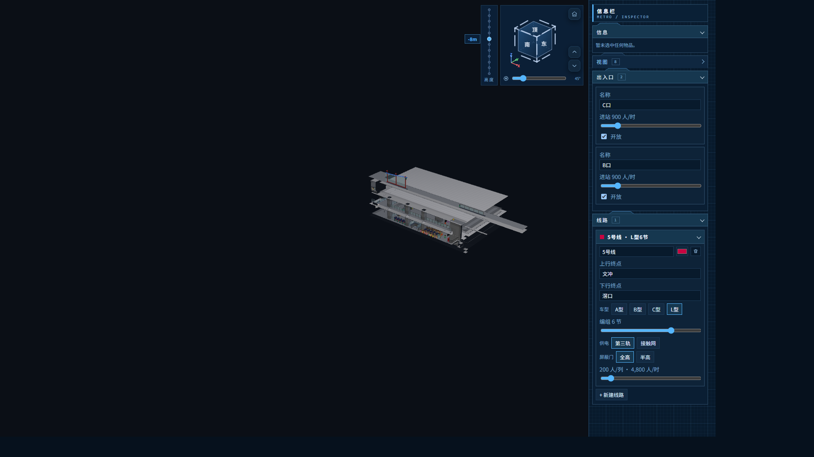

# Metro Station Designer

**A 3D sandbox about moving crowds through a metro station you build yourself.**

Block-based construction (1 block = 1 m) with hard-edged voxel art, real rolling stock, real
passenger flow. No money, no staff hiring, no upkeep: you build, the crowds arrive, and the
station either copes or it does not.

| | |
|---|---|
| **Platform** | React 19 + Vite + TypeScript, three.js via react-three-fiber, Web Worker simulation |
| **Mode** | Sandbox / puzzle-sim. Single player. |
| **View** | 2:1 isometric 3D, cutaway, per-level slicing, full orbit |
| **Status** | Specification (draft 10). Concept sheets in [`art/`](art/), generator in [`tools/`](tools/) |
| **One-liner** | Overcrowd's readable doll-house dioramas, Mini Metro's flow pressure, real Chinese metro rolling stock |

---

## 1. Concept art

All sheets are vector, generated from [`tools/gen-art.mjs`](tools/gen-art.mjs) (`node tools/gen-art.mjs`).
They are drawn in a **true isometric** projection (equal foreshortening on all three axes,
1 block = 1 m), so they double as an art-direction target rather than loose mood boards and a
rendered piece stands in a drawing undistorted. Every sheet is drawn in
the shipping language, **Simplified Chinese**; only identifiers and units stay in Latin script
(§9.2). Sheet 12 is animated (SMIL, self-contained).

### 1.1 The station you are building — isometric cutaway



A B1 concourse in doll-house view with the roof cut off, and the B2 platform visible through the
escalator void. Nine readable zones: fare gates, ticket machines, retail, platform, circulation,
surface entrance, advertising, floor guidance, lift. Everything here is a placeable module from
the catalogue, and every person is a simulated agent with a destination.

### 1.2 Depth is not decoration — vertical section



One station, four levels: an over-ground viaduct (Line 1, catenary), the surface plaza with the
entrance pavilion, a B1 concourse, a B2 platform behind screen doors and a B3 platform. Every
level change is a walk, a queue and a capacity limit. This is the drawing that drives the whole
simulation design.

### 1.3 The block system



One block = one cell with six faces. Faces carry surfaces (floor, ceiling, walls per side), and the
8-neighbour autotile mask decides which of them are drawn: a side a solid neighbour shares draws
nothing, so a run of blocks is one flat surface. A block itself is a hard cube.

### 1.4 What you can place



Fifteen of the placeable modules with their real footprints and the throughput numbers the
simulation actually consumes.

### 1.5 Rolling stock



A / B / C type cars following the Chinese metro classification: car width sets the platform edge,
door count sets the boarding rate, power pickup decides tunnel or viaduct.

### 1.6 Crowd demand



Time-of-day curves, calendar multipliers, transfer paths across depths, and the per-exit flow
controls that shape all of it.

### 1.7 Interface



Build rail on the left, inspector on the right, line manager and minimap along the bottom. The
camera is the level selector. The mock is drawn in the shipping language, Simplified Chinese (§9.2).

### 1.8 Camera and views



Full 360° orbit like a CAD viewport, plus true orthographic elevations. The same station model,
six ways of looking at it — and the flat X-Z elevation is the view that tells you whether the
vertical circulation actually works.

### 1.9 Queue management

A crowd that arrives as a blob blocks everything; the same crowd in single-file lanes is orderly,
predictable, and fits in a quarter of the floor. This is the cheapest capacity in the game.

### 1.10 Where the look comes from

The art direction is not invented. It is a stylised read of real Guangzhou Metro stations:
high-key white baffle ceilings, glossy coloured enamel wall panels with visible seams, light
speckled granite floors with dark inlay bands, brushed stainless columns on dark bases, full-height
platform screen doors with a line-colour header band and a red warning band, and saturated
safety-yellow tactile strips and arrows.

Reference photographs studied for this pass (Wikimedia Commons, CC BY-SA 4.0):

* *Platform 3, Guangzhou South Railway Station* — Line 7, the yellow enamel wall panel and the
  station-name typography. `commons.wikimedia.org/wiki/File:Platform_3,_Guangzhou_South_Railway_Station,_Guangzhou_Metro_20240331.jpg`
* *Platform 2, Guangzhou East Railway Station* — Line 11, white linear baffle ceiling, oval
  stainless columns, dark granite inlay bands in the floor, PSD header with the route strip.
  `commons.wikimedia.org/wiki/File:Platform_2,_Guangzhou_East_Railway_Station,_Guangzhou_Metro_20251113.jpg`
* *Guangzhou Railway Station (metro), Line 2 platform* — concourse-adjacent platform, signage and
  lighting treatment. `commons.wikimedia.org/wiki/File:20250222_Guangzhou_Railway_Station_(metro)_-_Platform.jpg`
* *Platform 1, Shiweitang Station* — an older station for contrast.
  `commons.wikimedia.org/wiki/File:Platform_1,_Shiweitang_Station,_Guangzhou_Metro,_20250114.jpg`

These are references only. No photograph is shipped in the game or this repository; the palette and
motifs are reinterpreted in `tools/iso.mjs`.

### 1.11 Rolling stock in 3D



The same A / B / C cars as §1.5, drawn the way the game builds them: a rounded-roof cross-section
extruded along the run, carrying the window band, the door leaves, the livery band, the bogies, the
roof equipment and a cab at **each** end. Both cabs are the same body — the dark face mask with its
windscreen, crew-door windows and 广州地铁 mark, the twin lamp clusters and corner marker bars, the cream
bumper band and the coupler — and differ only in their lamps: white at the end that leads, red at the
end that trails. The consist panel and the platform interface put the car against
the screen doors and the third rail, and the power-pickup panel sets catenary against third rail.

### 1.12 Platform doors and flow



The car-door cadence is authoritative. One function returns the door centres, and the PSD openings,
the queue lanes and the boarding and alighting paths are all placed from that same list, so the
screen doors can never drift from the doors they are meant to meet. Inside a car the doors sit on
one uniform pitch, held clear of both car ends (`DOOR_END_INSET`, the cab or gangway the end keeps —
about 2.8 m, as on the real cars), so a three-door L car spreads its outer doors to the ends rather
than bunching them in the middle, and the screen run repeats that same cadence. The sheet is
animated: a 20 s enter / dock / open / board / close / leave loop.

### 1.13 Two lines, two depths


Concept 02 as a volume. One line runs over the street on a viaduct, one runs under it in a box, and
the whole transfer stack sits between them — B2 platform, B1 concourse, the street, the viaduct
platform. The near quarter is cut away, which is also how the game's cutaway camera works.

---

## 2. Vision

You are handed an empty plot, a grid and a crowd demand curve. You cut a box into the ground,
line it with tiles, drop in gates and escalators, lay track, and connect it to the city. Then you
watch: a wave of passengers comes down the stairs at 08:10, the escalator becomes the bottleneck,
the platform hits crush density, a train arrives and 240 people try to get off through the same
four doorways that 180 people are trying to get on.

There is no fail state and no budget. The scoring is legibility: the game shows you exactly where
your station breaks, in real time, as a heat map, a queue and a wave of little people.

### Pillars

1. **Build like a game, read like a diagram.** Chunky blocks you can snap together in seconds, but
   the layout reads as a real station drawing.
2. **The crowd is the content.** Every visible passenger is an agent with an origin, a destination
   and a decision. No fake crowd textures.
3. **Depth costs.** Vertical distance is real travel time. A deep transfer is a design problem, not
   a decoration.
4. **Readable failure.** The player must always be able to see *why* it broke: a red density blob,
   a growing queue, a train leaving people behind.
5. **Sandbox, not tycoon.** No money, no staff, no upkeep. Only geometry, capacity and time.

### Explicitly out of scope (v1)

- Hiring, wages, staff assignment, morale, training.
- Construction cost, ticket revenue, budgets, loans.
- Failure/ bankruptcy states, timers, scripted scenarios (the calendar can *offer* an event day, but
  it never fails you).
- Multiplayer, mods SDK (planned for M6).

---

## 3. Core loop

The game plays as a 9-stage loop. Stages 2–8 repeat; the station is never finished, only
less broken:

```
1  起点      2×2 ground block at (0,0,0), infinite canvas
2  毛坯      extrude the rough station volume (under / at-grade / viaduct)
3  饰面      walls / floors / ceilings / track beds + textures
4  设备      place and remove modules on top of the blueprint
5  列车      line + train config (type, frequency, length, route, colour)
6  出入口    exit config (name, in/out throughput)
7  运行      sim runs, passengers arrive / exit, counts + waits recorded as charts
8  存档      save / load a snapshot (§9.4, §10.5)
9  迭代      repeat 2–8
```

1. **Start (起点).** A new station is a flat 2×2 block on the surface at world origin
   `(0, 0, 0)` (§4.1). The canvas is unbounded: blocks may be placed at any integer
   coordinate, attached or detached. There is no plot edge and no scrolling cost —
   the camera frames whatever exists.
2. **Massing (毛坯).** The player extrudes the rough shape with the base-block tool:
   drag / box-drag solid vs empty cells on any level, below ground (underground box),
   on the ground (at-grade hall), or above it (viaduct deck + piers). No surfaces, no
   modules yet — just the cavity and the solid that surrounds it.
3. **Surfaces (饰面).** Walls, floors, ceilings and track beds are painted onto the
   massing (§4.3): whole-surface fill for speed plus per-block texture override for
   detail. This pass is cosmetic *and* structural — a floor finish decides walk speed,
   a ceiling decides cover, a wall decides blockage.
4. **Modules (设备).** Doors, gates, TVMs, exits, stairs, escalators, lifts, PSDs and
   queue furniture are placed onto / into the blueprint and can be removed freely
   (§5). Modules snap to cells but sit *on top of* the block model, so deleting a
   module never deletes the block under it.
5. **Trains (列车).** Each platform edge is assigned a line: stock type (A/B/C), cars
   (length), headway (frequency), dwell policy, route (ordered stops), line colour
   (§6.3). The game derives and displays per-line passenger throughput
   (capacity/hour = cars × rated/car × 3600/headway) next to the editor.
6. **Exits (出入口).** Each surface exit gets a name (e.g. `A口`, `C口`) and settable
   in/out rates per hour (§5.6). The game shows configured vs actual throughput live.
   An exit set to 0 in is a closure — the crowd re-routes.
7. **Run (运行).** The clock runs: street trickles and train-borne waves spawn agents,
   they buy, queue, walk, ride, alight and leave (§7). Passenger counts and wait times
   are recorded per exit / gate / line / platform and drawn as time-series charts and
   histograms (§8.1), not just as 3D heat.
8. **Snapshot (存档).** Any paused moment can be downloaded as a `*.metro.json`
   snapshot — all static blocks plus all movement — and reloaded later (§9.4, §10.5).
9. **Iterate (迭代).** Read the charts, find the pinch point, go back to stage 2:
   move a wall, add a gate, split a flow, retime a headway. Determinism (§7.6) makes
   every re-run a true A/B.

A design session is 20–60 minutes: a station that starts as a 2×2 slab ends as a machine
for moving people, and the last 10% of capacity always comes from moving a wall.

---

## 4. Blocks, surfaces and levels

### 4.1 The cell

One block is one cubic metre. World coordinates are unbounded integers `(x, y, z)` with
`+z` up; the level id (`B3`…`B1`, `G`, `L1`) is a named band of `z`, not a separate axis
(§4.4). A new station seeds a flat 2×2 at-grade slab at the origin:

```
seed = { x: 0..1, y: 0..1, z: 0 }   // labelled (0, 0, 0) in the HUD status line
```

* **Infinite canvas.** Builds may grow to any `(x, y, z)`; nothing must touch existing
  geometry. Detached blocks (a second entrance pavilion 200 m away, a depot siding) are
  legal — the camera (`F` frames selection, minimap tracks extents) follows, and the
  station graph simply has no walk edge between disconnected parts until the player
  connects them.
* **Sparse storage.** Only non-default cells exist in memory and in saves; untouched void
  costs nothing, so a far-flung but tiny station stays tiny (§10.5).

A cell owns six faces and nothing else:

```
cell = {
  x, y, z,                  // integer world coords; level derived from z
  fill,                  // solid | empty | water-like (unused in v1)
  faces: {
    top:     { material, floorFinish, decals[] },   // walking surface above
    bottom:  { material, ceilingFinish },           // ceiling below
    n, e, s, w: { material, wallSide, door?, window? },
  },
  tags: [],              // e.g. "paid-zone", "platform-edge", "no-roof"
}
```

Everything the game shows — walkability, cover, signage, whether rain reaches the platform — is
derived from these six faces. That keeps the build model small and makes save files tiny.

### 4.2 Autotiling: which faces are drawn

* **Mask.** Each cell computes an 8-neighbour mask (4 orthogonal + 4 diagonal).
* **Geometry.** A block is a **cube**: its six faces are the cell's own six faces, extruded on the
  1 m grid. There is no top-rim chamfer and no corner rounding — the rim of a block is a square
  edge, and the corner of a block is the corner of the cube. (Sheet 03 used to be titled 倒角方块
  after the 12.5 cm bevel cut off every exposed top edge; that cut is gone, and the sheet follows.)
* **A shared edge is flush.** A side a solid neighbour shares draws nothing at all: it is the same
  building, so the two blocks' top faces are one plane and the cell boundary between them is not
  drawn. A run of blocks is therefore one flat surface with no seam down it and no pit at a
  four-block corner.
* **Merging.** Blocks are merged per 16×16×16 chunk into a single `BufferGeometry`. Floor decals,
  tactile strips, signage and arrows are separate transparent quads drawn on top so they never
  break a merge.
* **Why cubes.** A hard, axis-aligned edge is what the 1 m grid actually is, and it is what keeps
  the renderer's one hard case — a corner where two open sides meet — from needing geometry of its
  own. The softened look of a station comes from its finishes, its modules and its light instead.
  See sheet 03.
* **A cut top.** A block a 楼梯 / 扶梯 takes its volume out of — the ground under a run, which its
  truss or soffit hangs into — is not a full cube. Its top is the run's own **underside**, a plane
  sloping along the run, so the block reads as the filling under the slope and the run's truss sits
  on it instead of disappearing into it. It is a *cut*, not a chamfer, so the block keeps its sharp
  edge there. Nothing is stored: the cut is derived from the run (`rampSlopeCuts`), so there is no
  filling-block piece in the document to keep in step with the run that made it.

### 4.3 Surfaces and what they do

Four paintable surface families cover the six faces. The *family* decides behaviour; the
*texture* inside the family is a visual + minor-stat choice from `data/materials.json`:

| Family (中文) | Faces | Gameplay effect |
|---|---|---|
| 地面 Floor finish | top face | walk speed multiplier, noise, spawn of decals |
| 天花 Ceiling finish | bottom face | light level, rain cover, ornament |
| 墙面 Wall finish | n/e/s/w, inner/outer side | blocks movement and sight, hosts signage, doors, windows; side finish gives direction cues (tile vs painted) |
| 轨道 Track bed | top face variant on track cells | ballast / slab look; required under rails, derates walk speed to ~0 (no walking on track) |

The structural block body itself (`solid | empty`) blocks movement and defines the cavity;
decals (guide stickers, tactile strips, adverts, wayfinding) are a transparent quad layer on
top of any family and never break a merge.

**Paint tools (left rail: `N` 单块, `M` 整面):**

* **单个块 (single block, `N`)** — click one cell face to override just that block's texture
  within its family. Per-block overrides win over the fill and render as a tint badge in
  the inspector (`已自定义`).
* **整个表面 (fill surface, `M`)** — click one face to flood-fill its connected same-family
  region on that plane (same level, same orientation) with the chosen texture. The fast
  pass for stage 3 of the loop: paint a whole concourse floor or an entire wall run.
* `左键` paints, `右键` erases (reverts to family default) in both tools — see §9.5 for the
  full mouse table. `吸取` (`P`, the 工具 folder's eyedropper) picks the clicked surface as the
  active brush — and a placed 设备 / 装饰 piece instead arms that piece's placement (see §9.5).
  Both tools preview as ghosts, are undoable, and mark the save dirty.
* The `N`/`M` choice **sticks**. It is a setting of the 材质 folder, not of a texture: choosing a
  finish (or a fresh 搪瓷板 colour) never changes it, so it is still there when the player comes back
  from another folder on the left rail.

### 4.4 Levels and depth

Levels are named slices with a depth in metres, not free-floating floors:

```
level = { id: "B1", z: -5.5, kind: "underground" | "at-grade" | "viaduct", height: 4.5 }
```

* `underground` — carved into soil, enclosed, no rain, third-rail-friendly.
* `at-grade` — ground level, the default entrance storey.
* `viaduct` — elevated deck with piers; the space below is open air and can host other buildings.

Rules that fall out of this:

* Vertical distance between levels is a cost in the agent pathfinding graph.
* Rain only affects `at-grade`/`viaduct` platform exposure (comfort, no mechanical failure).
* Only `underground` cavities require ventilation logic for the (cosmetic) ceiling.
* Track on a viaduct requires catenary clearance; track in a tunnel forces third rail. See §6.

### 4.5 Zones

Fare zones are an explicit model, not an implied one. Every floor cell belongs to exactly one zone:

| Zone | Meaning |
|---|---|
| `outside` | beyond the station footprint: street, plaza, other buildings |
| `unpaid` | concourse before the fare line: TVMs, retail, customer service |
| `paid` | concourse and passages after the fare line |
| `platform` | platform areas; reachable only from `paid` |
| `restricted` | plant rooms, staff areas, depots |

Rules:

* A **gate** is the only legal crossing between `unpaid` and `paid`. Without a gate, the station
  graph has no edge, so agents physically cannot walk through — no special-casing in the sim.
* **Ticket machines must sit in `unpaid`.** Retail and vending may sit in either, and that is a real
  design choice: unpaid retail catches people on the way in, paid retail catches people waiting for
  a train.
* **Interchange passages can be `paid` → `paid`** (a true inside-the-barrier transfer) or require
  re-gating through `unpaid`. Both are legal; the second costs every transferring passenger a gate
  queue, and the transfer-time report shows it immediately.
* Painting zones is a bucket tool, but the game infers the obvious case: a room fully enclosed by
  gates and platform edges is proposed as `paid` and shown as a dashed tint until confirmed.

Zones give the overlays something real to colour, and they give the builder the single most
consequential decision in a station: where the fare line goes.

---

## 5. Modules

Every module is a footprint (`a × b` blocks), a rotation, and a set of simulation properties. This
is the whole build palette for v1. Stage 4 of the loop: modules are **placed onto and removed
from the blueprint** — they snap to cells and ride on faces, but they are not blocks. Deleting
a module restores the block underneath; deleting a block underneath deletes (refunds) the
modules standing on it, with a confirm if §9.3 confirmations are on.

### 5.1 Circulation

| Module | Footprint | Capacity / rate | Notes |
|---|---|---|---|
| Staircase | 3 × 6 (per 3.5 m rise) | 25 pax/min per metre up, 33 down | width scales with footprint; queuing happens at the foot; handrails are modelled so the run is walkable |
| Escalator | 1 × 8 | 75 pax/min, one direction | theoretical 150/min at 0.5 m/s; observed flows under crowding land at 60–80, so 75 is the design value |
| Elevator / lift | 2 × 2 | 15 pax/trip, ~40 s cycle | the only step-free path; agents that need it will wait rather than climb |
| Ramp | 2 × n | 30 pax/min per metre | accessible, slow |

Two runs of one storey may stand **flush** in adjacent cells. Every run is built to fit inside one
tile — an escalator's balustrades, glass and handrails, and a *narrow* staircase's treads and rails,
all inside its own 1 m cell — so a pair simply sits side by side, each carrying its own balustrade,
and a bank of runs reads as one group with no slot in the middle. It also means a wall, a fence or a
gate may be built right up against a run. A wall that hugs a flight **from bottom to top** replaces
that side's handrail: the flight keeps the stringer it meets the wall with and is railed on its open
sides alone. The wall must run the whole flight, at the flight's own heights — a wall that stops at the
half-landing, or carries a doorway the flight passes, leaves the handrail on.

A **wider staircase is lanes**: one, two or three parallel flights, each one escalator band (0.7 m),
each in its own cell — so a 2-lane stair is two 0.7 m lanes in two blocks, a 3-lane stair in three —
and the tool's action tile names those three **sizes** 窄 / 中 / 宽 rather than quoting a width.
Neighbouring lanes always **join their steps** (each flight's treads run out to the cell edge, so
there is no gap between them). Whether they are *one* staircase is a property of how they were
placed: the lanes of one wide stair share a flight token, and along a seam between lanes that share
it there is **no handrail** — the flight is railed only at its outer edges, and the crowd may step
between lanes at the landings. Two 0.7 m stairs placed separately keep both of their own railings
(their steps still meet, but the rails between them are a barrier), and a lane set against an
escalator keeps its balustrade and does not reach under it. The lane
count follows the pointer: dropped beside a stair on its left, the flight takes the cells on
its right, and the other way round. A stair that is a single piece wider than a cell — a *turning*
stair, whose flights cannot share their landings lane by lane, or a station saved before lanes — is
the exception: at 中 / 宽 its runs fill two and three whole blocks, so it needs a bay of its own (a
双跑楼梯's runs are block-wide, below).

A **switchback staircase** (双跑楼梯) turns a storey back on itself: two parallel flights with a
half-landing between them. Its runs are laid **flush** — balustrades back to back on the seam, the shared
centre rail a real 双跑楼梯 has, with no floor left between the runs — so each run is built to fill its own
**blocks**, balustrades included (0.79 / 1.79 / 2.79 m of treads at 窄 / 中 / 宽, where a lane count would
give 1.36 m at 中), and both bands are then laid on the block grid: the returning flight's *path* stands
one block per lane across and the pair moves half a block (a whole block at three lanes) so its treads and
rails end on the cell edges. Its **size is the blocks the pair takes across**, two per run: **2 blocks at
窄, 4 at 中, 6 at 宽**, growing along the run's right from the base cell, and the platform they turn on
is **one block deep** — the row the runs meet in, which is the floor the crowd walks across — rather than
as deep as the runs are wide. A wall built beside the piece
therefore stands flush against a run's outer balustrade and against the half-landing's long sides, and
those railings — like a flight's (`stairWallSides` / `stairLandingWalls`) — are dropped: the wall is the
barrier there. It comes in both hands (右双跑楼梯 / 左双跑楼梯); a
rotation turns the
piece about its base and never swaps the hand of the turn. The half-landing is a **walked** row of
cells — both flights join the graph to it — so each flight's balustrade stops at the flight end where
it meets one, and only an outer landing keeps the over-run that stops the crowd cutting the corner.

Travel direction is
irrelevant to standing flush (an up and a down escalator are the usual bank); a run in a column
another run already occupies is still refused, so a second escalator can never be dropped immediately
below a first.

A run is founded on the ground it climbs over, and its body hangs **below** its walking line — an
escalator's truss, half a metre of it (`RAMP_FOOT`), or a staircase's stringers and the soffit they
carry, a little less (`STAIR_BODY_DROP`), because a stair's underside is the surface the ground under it
has to meet and cutting it to a truss's depth leaves a slot of daylight under the steps. The **line** the
cut follows is the run's own as well: an escalator's truss really does run landing centre to landing
centre, but a staircase's treads stop half a landing cell short of each centre and still carry the whole
rise, so the body under them is the steeper line — a 3-cell turn flight climbs at 45° where the
landing-to-landing line is 33.7°. So a block under a run is
floor like any other: the 方块 tool lays it, the carve does not take it away (the carve opens the run's
passage from the walking line **up**, and keeps the landings as the graph's nodes), and the renderer
shaves its top to the run's underside (§4.2), tile by tile, so what stands under a 扶梯 is the filling
under the slope rather than a cube with the truss buried in it. Only the column the run's own walking
line passes through is cut, and a run's **landing columns** are left whole — they are the floor the
crowd stands on at the foot of the run, so a block there is cut level with that surface, never on a
slope. A block the run's body never reaches is left exactly as it was built. The cut is a *surface*:
the crowd's model of a block is still its cell top, which is why it only ever happens below a run's
walking line and never in a column anyone walks. The cap it leaves is the **run's** surface, not the
ground's: a 楼梯 painted with the 材质 brush (`cfg.finish`) paints the ground it stands on with it,
while the block's own sides stay the ground's.

An **escalator carries that course itself**: its 扶梯 piece is solid under the truss over the cells the
ground's own filling covers — a closed prism across the balustrade width, from the lower landing's
walking line up to the plane the ground under a run is shaved to (`RAMP_FOOT` below the walking line,
above), which its lid follows to its very end — instead of leaving it to a derived surface the renderer
has to tell its neighbours to treat as solid. Its lid *is* that plane and its flanks are flush with the
truss box's own, so the body, the shaved ground and the truss read as one solid with no step and no
slit, standing exactly where the ground's own filling stood. A
staircase takes neither course beyond the ground it really has: its soffit and stringers hang below the
treads' own line **and end at the treads** — a landing's column is never cut, so a beam overhanging it
would be swallowed by the floor at the foot of the run — the blocks its flight meets are shaved to that
line, and where there is no block it
hangs over its own well, open — a derived filling under it would stand in the run's own carved passage,
a mass no block fits in and no 材质 brush can register on. The half-landing floor
a turning staircase lays is the **stair's** own cell — the mesher skips it and the model draws the
platform — so deleting the stair takes it back out with the piece, and a straight staircase lays none.
**移动** takes a staircase — and an escalator — apart and builds it again at the cell it is dropped on
rather than translating it (`moveRebuilds` / `moveEquipment`), because a run's `from`/`to` and flights are
world cells of the document's, and because the slab it climbs through is opened where it now stands: the
floor it owns, the opening it carves and the turn it makes all travel with the piece, in one commit.

### 5.2 Fare control and service

| Module | Footprint | Capacity / rate | Notes |
|---|---|---|---|
| Turnstile gate | 1 × 2 | 25 in / 25 out per min | bidirectional configurable; queue anchor side selectable; a 1250 mm machine — 957 mm shoulder, a head tapering at 115° so its top is shorter than its base — whose piece cycles with `Tab`: **lane** (default) is the working turnstile, machine body on one half of the block with the lane and its leaf on the other, so a 围栏 run butts the body's solid side and ends at the doorway on the lane side, and **fence** keeps that body with fence on the other half, closing a run rather than passing anyone. Which hand the lane is on is not a setting — `R` turns the piece |
| Accessible gate | 2 × 2 | 18 pax/min | luggage, wheelchairs, strollers; slower because the users are |
| Ticket machine (TVM) | 1 × 1 | **1.5 tickets/min**, 4 queuing | a real transaction is 30–60 s. This is the queue that catches new players out |
| Add-value machine | 1 × 1 | 1.8 pax/min | faster than a TVM: no ticket issue |
| Ticket office window | 2 × 2 | 8 pax/min | unmanned in sandbox; a slow service point |
| Vending machine | 1 × 1 | +6 s dwell, +comfort | no throughput, all lure |
| Retail unit / store (商店) | ≥2×2, any size (§5.7) | area-scaled: `shoppers/min ≈ 0.2 × area`, dwell 4–10 min | draws and releases agents, can seed a platform crowd; bigger floor = more flow |
| Convenience kiosk / cafe (便利店/咖啡) | ≥2×2, any size (§5.7) | area-scaled: `shoppers/min ≈ 0.3 × area`, dwell ~3 min | smaller, faster, noisier; same scaling rule |
| Bench | 1 × 4 | seats 6 | comfort, lets agents wait out a headway |
| Info pillar (totem, 问讯柱) | 1 × 1 | wayfinding radius 8 m | cuts decision time; custom text §5.8 |
| Guide sticker / floor map (地贴/导览) | 2 × 2 | −15 s search per agent | cheapest fix in the game; custom text §5.8 |
| Ad billboard (广告牌) | 4 × 1 | +browse chance, +dwell | wall-mounted; custom text §5.8 |
| Digital ad tower (广告柱) | 1 × 1 | same, smaller | floor-standing; custom text §5.8 |
| Wall TV (壁挂电视) | 2 × 1 wall (§5.8) | next-train / info / ads | wall-mounted screen; mode + custom text |
| Hanging TV (吊挂电视) | 1 × 1 ceiling (§5.8) | same | double-sided; concourse + platform |
| Standing display (立式广告机) | 1 × 1 floor (§5.8) | same | floor totem screen |
| Restrooms (卫生间) | ≥2×2, any size (§5.7) | area-scaled stalls, +dwell 90 s, comfort | stalls = `floor(area/4)`; queue forms outside when full |
| Vent shaft / light well | 2 × 2 | +1 air-quality step on its level | see §7.7; the design answer to deep, sealed concourses |

### 5.3 Platform edge and access

| Module | Footprint | Capacity / rate | Notes |
|---|---|---|---|
| Platform screen doors (full) | 2 × 1 per pair | 24 doors/min/car, +2 s per boarding | glass, blocks the platform from track; header display auto (§5.8) |
| Half-height PSD | 2 × 1 per pair | same, cheaper | open above, allows smoke clearance; header display auto (§5.8) |
| Platform edge + tactile strip | per-edge decal | — | required for a legal boarding zone |
| Swing door | 1 × 1 | 1.2 pax/s when open | can be locked (closed = wall) |
| Wide barrier | 2 × 1 | 40 pax/min | staffed gates, luggage |
| Station exit (surface) | 2 × 6 | **settable in / out per hour** | see §5.6; the primary demand control |
| Emergency exit | 2 × 4 | 0 until triggered | counted for evacuation analysis only |

### 5.6 Exits — names and throughput (出入口)

Stage 6 of the loop. Each surface-exit instance carries its own config, edited in the right
inspector (`出入口` tab) and stored in the save's `static.modules[].cfg` + `config.demand`:

```
exit = {
  name: "C口",              // player-set, shown on signage, minimap and charts
  inRate: 600,              // pax/hour entering the station (0 = closed for entry)
  outRate: 600,             // pax/hour leaving the station (0 = closed for exit)
  open: true,               // quick toggle; closed = both rates forced 0 but remembered
}
```

* Defaults: a new exit is named for the next free letter `A口`–`Z口` (the placeholder
  `未命名口` returns once all 26 are taken), 600/600 pax/h. Rates clamp to 0–6000/h in steps of 10.
* **Throughput readout.** The inspector shows configured (`设定`) vs actual (`实际`, rolling
  5-min mean from the sim) in/out side by side; the §8.1 exit chart plots both series per
  exit, so an exit that cannot discharge its demand is visible as a gap between the lines.
* Closing an exit (either rate → 0, or `open: false`) re-routes agents through the graph —
  no teleporting. The transfer/wait charts move immediately, which is the point.

**Geometry.** A surface exit is a head-house over runs that stand **side by side**: one run column
per bay, with one full block of floor at each end — so a 单向 / 双向 / 三向 head-house is 3 / 4 / 5
blocks across. Each run owns the block it lands in (its wellway opens exactly that block, wider only
for a piece wider than a block), which keeps the floor pad whole beside it. The runs are entered at
the street doorway and descend one storey to the hall below; a run dropped inside the head-house
snaps to the column under the pointer, so they cannot end up a bay apart.

### 5.7 Variable-area shops / cafes / buildings (可变面积)

Retail, cafe/kiosk and restrooms are **not fixed footprints**. Each declares only a
minimum; the player drags any rectangle at or above it, and flow scales with floor area.
Large shops generate more flow — exactly proportional, no hidden tiers.

```
place: J tool → pick type → 左键 drag rectangle (≥ min) → release to confirm
resize: V select → drag corner handles (snaps to 1 m); R swaps w/h for square mins
```

| Type | Min | Area rule (flow) | Capacity rule |
|---|---|---|---|
| 商店 retail | 2×2 | `shoppers/min = 0.2 × area` (24 m² → ~5/min, matches old 4×6) | `maxInside = floor(area / 2)`; overflow queues outside |
| 便利店/咖啡 cafe | 2×2 | `shoppers/min = 0.3 × area`, dwell ~3 min | `maxInside = floor(area / 1.5)` |
| 卫生间 restroom | 2×2 | `users/min = 0.15 × area` | `stalls = floor(area / 4)` (min 1); full → outside queue, +90 s dwell each |

Rules:

* Area = `w × h` blocks = m². Ghost preview shows `宽×深 = 面积` plus predicted
  `人/分` so the size→flow trade is visible before confirming.
* Attraction weight in trip sampling (§7.4a) uses the same rate: a 48 m² store draws
  ~2× the stops and destinations of a 24 m² one. Doubling floor space doubles flow
  draw, but also doubles rent-free floor agents must walk around — the corridor cost.
* Shrinking below occupancy (e.g. 10 inside a resized-to-6 shop) pushes extras out as
  `leaving` agents; growing never evicts. Both mark save dirty.
* Saved per instance as `w, h` alongside `x, y, z, rot` (§10.5). Fixed modules omit them.

### 5.8 Custom text signage + displays (标识/屏幕)

Ads, maps, pillars and signs all take player text. Screens add live train info on top.
All labels Simplified Chinese; text fields accept Chinese + digits + the ASCII ids from
§9.2 (line numbers, `A口`, `2号线`).

**Custom-text modules (static文案, player-typed):**

| Module | Lines × chars | Editing | Gameplay note |
|---|---|---|---|
| 问讯柱 info pillar | 2 × 12 | inspector `文案` tab, textarea | cosmetic; 8 m wayfinding bonus (§5.2) applies regardless of text |
| 地贴/导览 guide sticker | 2 × 12 + auto mini-map | same | −15 s search applies regardless; mini-map corner auto-draws station extents |
| 广告牌 billboard | 3 × 16 | same; swatch for bg colour | browse/dwell bonus unchanged in v1 |
| 广告柱 ad tower | 2 × 10 | same | same |
| 吊牌 hanging sign | 2 × 8, double-sided | `J` ceiling-face + `文案` tab | pure wayfinding, no bonus; the cheap overhead label |
| 指示牌 sign (吊挂 / 墙面) | a board of up to 10 marks | its own board editor (the 自定义 action) | two mounts, one board: 吊挂 hangs by rods from the ceiling and prints both faces, 墙面 is bolted flat to a wall at reading height and prints 正面 alone |

Rules: select module → right panel `文案` tab → type → live 3D preview on the quad.
Over-long input hard-clamps with a counter (`12/12`); empty text renders the module
default (`问讯处`, `本站导览`, …). Text is cosmetic in v1 — it never changes routing,
only readability. Saved as `cfg.text[]` (§10.5).

A **指示牌** is composed in its own editor rather than typed into a box: arrows, line
shields, labels and pictograms are dragged onto the board, which grows with what it
carries. It comes in **two mounts**, and the mount is the piece's own (`cfg.mount`):
**吊挂指示牌** hangs from the storey ceiling and is read from both faces, **墙面指示牌**
is a panel bolted flat to a wall at reading height and read from one — the wall is
behind it, so 背面 is not mounted. A wall board therefore wants solid backing on the one
course its 0.7 m panel crosses and nothing overhead, and a hung one the reverse. Its
marks include the red 禁止 roundel (a ring with a level strip across its diameter) and the green
出/EXIT plate, the two marks the renderer draws rather than loading as pictogram art.

**PSD header display (屏蔽门上方, automatic, not typed):**

Every PSD pair carries a header strip driven by the sim, not by the player. Content per
platform edge, from the assigned line (§6.3) + live timetable:

```
[ line colour band ]  2号线 · 往市中心 · 下趟 2:30 · 再下趟 5:00
states: 候车 (countdown) → 上车 (doors open, flashes destination) → 关门 (red 3 s) → 发车
```

Line name/colour/destination come from the line editor; ETAs come from headway + live
delay (late trains show `晚点 1:20` in amber). No text field — editing the line *is*
editing the header.

**Station TVs (电视, mixed auto + custom):** three mounts, one behaviour. Place with `J`
on the matching face (wall / ceiling / floor); each TV picks a mode in `文案` tab:

| Mode (模式) | Shows | Source |
|---|---|---|
| 到站 next-train | next 2 trains per calling line + crowd warning (`站台较拥挤` at LOS E/F) | auto from timetable + sim |
| 换乘 transfer | line colours, interchange arrows, exit names | auto from lines + exits (§5.6) |
| 广告/通知 ads | player lines looped as carousel | `cfg.tvLines[]` + `cfg.carouselS` (default 8 s) |

TV inspector: `模式` dropdown + (ads mode) 1–4 lines × 16 chars + `轮播秒数 4–30 s`.
A TV in 到站/换乘 mode ignores custom lines except a one-line footer (e.g. `小心站台间隙`).
Render: emissive quad, readable at 20 m, dimmed 50% when its level is ghosted (`X`).
Saved as `cfg.tvMode / tvLines / carouselS / footer`.

### 5.9 Platforms (站台) — build, label, serve

A **platform** is a named `platform`-zoned area (§4.5) plus one or more **platform edges**
bound to tracks. The player builds the floor, labels it once, then binds each edge to a
line/direction/side. Trains stop at edges; agents queue at doors.

```
platform = {
  name: "1站台",              // player-set; signage, PSD headers, charts, TVs
  edges: [edgeId],            // 1..n edges on this floor (island = 2, shared transfer = 2+)
}
edge = {
  track: trackId, line: "2", dir: "eastbound",   // which trains call here
  side: "left" | "right",                        // which side of the train opens
  doors: [doorIdx],          // derived from stock door centres (§1.13) × cars; ~20–40 per edge
}
```

**Build flow (`J` + zone bucket):** paint `platform` zone → floor cells adjacent to
track auto-propose an edge (dashed, `未绑定`) → click edge → bind line/dir/side in the
right `站台` tab → name the platform. Edge requires the tactile-strip decal (§5.3);
without a bound edge the floor is just a room agents will not board from.

**Door crowd distribution (50 doors problem).** Each boarding agent commits to one door
when it enters the platform (or re-rolls on arrival), then queues there:

```
doorChoice ~ 1 / (walkCost(entry → door) + k × queueLen(door) + crowdPenalty(door))
k ≈ 8 s/pax; re-pick cheapest door when waitQ(door) > patience (§7.2)
```

Walk-close doors fill first, then spill down the platform — the ends stay emptier until
the middle clogs, exactly like §7.8's reference peak. Alighting is fixed: onboard agents
exit through their car's doors, split across the platform width. Per-door queues are real
(§6.4): a door that cannot clear in dwell leaves its queue behind, shown per-door in the
Boarding overlay (§8).

**Two platforms, one train (Spanish solution).** Build an edge on *both* sides of the
same track stop, bind both to the same line/dir with `side: left/right`. The train opens
both sides; alighting splits by side preference (default 70% exit-side / 30% far-side,
editable per edge `下车比`), boarding draws from both platforms' queues in parallel.
Dwell uses the slower side's total (§6.4). Label two platforms (`1A站台`, `1B站台`) or one
island — the sim only sees two edges at one stop.

**Same-platform transfer.** Bind two edges of *different* lines to one platform floor
(island: line 2 east one face, line 5 west the other; or side-by-side). A
`train(A) → line(B)` trip (§7.5) then costs one walk leg across the floor — no stairs,
no gates — and the transfer-time chart shows it near zero. The platform inspector lists
all bound lines with colours so the shared state is visible; deleting one edge's line
reverts its would-be transfers to cross-level routing.

### 5.4 Track kit

| Module | Footprint | Notes |
|---|---|---|
| Straight track | 1 × 1 per metre | direction locked to a line |
| Curved track | n × n quarter arcs | min radius by stock type (R150 for B, R110 for C) |
| Switch / crossover | 4 × 8 | joins two tracks, allows reversing |
| Buffer stop | 1 × 2 | terminus |
| Third rail segment | 1 × 1 per metre | 750 V DC, forces tunnel or covered box |
| Catenary segment | 1 × 1 per metre + masts | 1500 V DC / 25 kV AC, viaduct or open cut |
| Platform edge for trains | per placed platform | must be within 75 mm of the car floor (auto-snap) |
| Depot / stabling siding | n × m | where consists park between services |

### 5.5 Queue management

The cheapest capacity in the game is not a bigger hall. It is telling people where to stand.

| Module | Footprint | Behaviour |
|---|---|---|
| Queue rail | 1 × 1 per metre | physical channel. Blocks sideways movement, so a lane cannot be jumped |
| Belt barrier (stanchion) | 1 × 1 | retractable belt; toggle open/closed at runtime to re-route a flow |
| Queue lane, single file | 1 × 1 per metre | painted lane. Agents join at the back and cannot overtake |
| Queue lane, two abreast | 2 × 1 per metre | double the rate, half the order |
| Switchback queue | 2 × 4 per fold | folded queue: 40 pax in 8 m² of floor |

A lane is a **server with storage**: slots at the back, one head at the front.

```
capacity = floor(L / 0.80) + 1      // 12 m lane -> 16 people
rate     ≈ 45 pax/min               // 0.6 m/s shuffling, single file
wait     = queue length / rate
```

The trade is deliberate. A free-for-all crowd through the same 1 m width moves ~60 pax/min, but its
front is chaotic, it spills sideways into whatever flow it is next to, and the wait is
unpredictable. A single-file lane is roughly 25% slower and completely legible — and because it is
a declared object with a length, the game can show you its wait time *before* the crowd arrives.

Why it matters more than it sounds:

* **Lanes stop a queue blocking a corridor.** A blob in front of three gates occupies the walkway
  beside them; a lane does not.
* **Switchbacks fit crowds into small rooms.** 40 people standing loose need ~48 m². Folded into a
  2 × 8 m switchback they need 16 m², and they are out of everyone's way.
* **They make the platform-door pattern possible.** Two lanes per door converging on the door with
  the alighting path down the middle is how Chinese metro platforms actually work (sheet 10, panel
  D). Two lanes at 45/min feed a door that takes 72/min, so the door stays the bottleneck — which
  is the honest answer, and the reason dwell time is a design variable.
* **They are the counterweight to escalators.** An escalator is capacity; a lane is order. A station
  with plenty of both survives a peak.

One caveat, and the game models it: a lane commits everyone in it to a single head. If the ticket
machine at the front is slow, the whole lane waits, and re-routing is expensive because agents
cannot leave a lane sideways.

---

## 6. Lines, track and rolling stock

### 6.1 Stock types

Numbers follow the Chinese metro car classification (A/B/C/L); treat them as the tuning baseline and
verify against GB 50157 before shipping.

| | Type A | Type B | Type C | Type L |
|---|---|---|---|---|
| Width | 3.0 m | 2.8 m | 2.6 m | 2.8 m |
| Length / car | 22.0 m | 19.5 m | 19.0 m | 16.8 m |
| Height | 3.8 m | 3.8 m | 3.6 m | 3.6 m |
| Doors / side | 5 × 1.4 m | 4 × 1.3 m | 4 × 1.2 m | 3 × 1.4 m |
| Crush / car | 310 | 240 | 200 | 215 |
| Rated / car | 250 | 200 | 170 | 170 |
| Consist | 6–8 cars | 4–6 cars | 4–6 cars | 4–6 cars |
| Power | catenary 1500 V DC / 25 kV AC | third rail 750 V DC | third rail 750 V DC (linear-motor variants exist) | third rail 1500 V DC, linear motor |
| Typical use | trunk lines, viaducts and open cuts | the workhorse tunnel line | lighter branches, automated lines | linear-motor lines (Guangzhou 4/5/6) |

### 6.2 Power pickup is a design constraint

* **Third rail** requires an enclosed or covered track bed. Place track with third rail on an
  over-ground level with no roof and the game flags it as invalid; you can still build it, but the
  level is marked "unsafe: live rail exposed".
* **Catenary** requires vertical clearance above the train (5 m to the wire), so it cannot go under
  a low concourse slab. It is the natural choice for viaducts.
* PSDs only make sense with a tunnel/covered box, which is exactly why underground lines get them.

### 6.3 A line

Stage 5 of the loop. The line is the unit the player edits in the bottom-rail line manager
(`线路` tab): you don't drive trains, you set a timetable, and the simulation holds it.

```
line = {
  id: "2",                  // route number, shown on signage + PSD header
  name: "2号线",             // player-set display name
  colour: "#2f7ef2",        // line colour: enamel panels, PSD band, charts
  stock: "B",               // A | B | C | L (§6.1)
  cars: 6,                  // consist length in cars; train length = cars × carLength
  power: "third-rail",
  headwayProfile: { peak: 150, offpeak: 240, late: 480 },  // s between trains per period (§6.5)
  direction: "eastbound",
  dwellBase: 25,            // seconds
  dwellPerPax: 0.35,        // extra dwell per boarding/alighting passenger
  terminus: "reverse" | "through",
  stations: [ ... ]      // ordered platform edges this line calls at = route
}
```

Editor fields map 1:1 to the requested train info: **type** (`stock`), **frequency**
(`headwayProfile`, shown as `高峰 2分30秒 · 平峰 4分 · 夜间 8分` + `24/15/7班/小时`),
**length** (`cars`, shown as `6节 · 117米`), **route** (`stations` ordered list,
click-to-rename stops), **colour** (`colour` swatch, applied to walls/PSD/charts).
Which hours count as 高峰/平峰/夜间 comes from the station peak windows (§9.6C) —
one clock shared by all lines.

**Throughput readout (载客量).** Next to the editor the game always shows the derived
capacity, so frequency vs length is a visible trade, not mental maths:

```
capacityPerTrain = cars × ratedPerCar(stock)     // e.g. 6 × 200 = 1200 pax (B)
trainsPerHour    = 3600 / headwayActive(t)       // headwayActive picks peak/offpeak/late by clock
lineCapacityHour = capacityPerTrain × trainsPerHour
actualHour       = measured boardings in the last sim-hour (§8.1)
```

If `actualHour` approaches `lineCapacityHour` and the platform population ratchets up
train over train, the line — not the stairs — is the bottleneck (§7.8).

The alignment itself is authored with the line tool rather than block by block — see
§13.1 — with free hand-placement reserved for junctions, crossovers and depot throats.

### 6.4 Boarding model

```
board(pax) = doors × doorRate(doorWidth) × ∝(crowding) × (1 − alightPenalty)
dwell = dwellBase + dwellPerPax × (boarding + alighting), clamped to [20 s, 90 s]
dwellDualSide = max(dwell(leftEdge), dwell(rightEdge))   // Spanish solution (§5.9)
```

* Boarding only starts after the last passenger of a preceding wave has cleared the door zone.
* **A door only opens where a screen door meets it.** The consist's two door banks open
  independently, and only a bank whose berth carries a `platform-edge` run with screen doors (§5.3,
  §5.9) is commanded open — the tunnel-wall side stays shut however long the train stands, and a
  rail with no platform beside it opens nothing. The drawn leaves follow the same rule, so what the
  player sees is exactly what the graph serves.
* A train that cannot finish boarding inside the clamp leaves people behind. That is the core
  "pressure" readout of the game: a platform that slowly fills over the morning peak.
* Agents decide to board when a train for their line is at the platform *and* the door they are
  queued for will accept them; the queue per door is real, not an abstraction.

### 6.5 Schedule simulation (发车模拟) — peak / off-peak timetable

No hand-placed trains. Each line runs a deterministic dispatcher in the worker (5 Hz tick);
the player sets frequencies, the sim holds them and reports delays.

```
period(t) = peak    if t in peakWindows (default 07:30–09:00, 17:30–19:00, §9.6C)
            late    if t outside serviceWindow early/late tails (05:30–06:30, 22:30–24:00)
            offpeak otherwise
headwayActive(t) = line.headwayProfile[period(t)]

dispatch(line):
  every headwayActive(t) seconds: spawn train at route start (or depot siding if built)
  run ordered stations[] at line speed; dwell per §6.4 (clamped 20–90 s)
  dwell overrun → train departs late with onboard kept; next dispatch still on
    headway grid → gap compresses behind a late train (bunching emerges, not scripted)
  terminus reverse: consist turns (dwell +30 s); through: consist exits, fresh one enters
```

* **Peak vs off-peak is one station clock.** Peak windows are edited once (§9.6C) and apply
  to every line; each line answers with its own three headways. Scrubbing the timeline
  across 09:00 visibly stretches the gap on every platform at once.
* **Alighting share** (default 45% at peak, §9.6C) decides how many onboard agents become
  platform arrivals per stop — the train-borne wave (§7.4). A short headway with long
  consists is smooth; a long headway with short consists is bursty.
* **Live outputs** per line: next-train ETA (drives PSD headers + TVs, §5.8), trains late
  count + max lateness (HUD), `actualHour` vs `lineCapacityHour` (§6.3). Suspend a line by
  setting all three headways to max (600 s) or emptying its `stations[]` — boarders
  re-weight to other lines/exits (§7.4a).

---

## 7. Crowd simulation

### 7.1 Agents

Every visible passenger is an agent. Target: **3,000 concurrent agents at 60 fps**, instanced.
A trip is an ordered waypoint list — origin, zero or more intermediate stops at any
building/location in the station, destination. Endpoints are never restricted to
entries/exits.

```
agent = {
  id, seed,
  trip: {
    origin: nodeId,         // entryId | trainId | moduleId (e.g. retail back-room spawn)
    stops: [nodeId],        // 0..n intermediate: TVM, retail, vending, restroom, bench, info pillar…
    dest: nodeId,           // exitId | lineId (train boarding) | moduleId (e.g. retail staff staying)
  },
  legIdx: 0,                // which trip leg is active: origin→stops[0]→…→dest
  state: "arriving" | "buying" | "queuing" | "walking" | "riding" | "alighting" | "waiting" | "leaving" | "browsing",
  speed: 1.34,            // m/s free flow, derated by density and stairs
  patience: 0.0..1.0,     // how long before they re-route
  group: 1,               // travelling companions stay loosely together
  needs: { stepFree: bool, luggage: bool },
  path: [nodeIds], pathIdx, // current leg's graph path (§7.2); rebuilt per leg
  comfort: 0..1,
}
```

* `od` in older drafts is `trip.origin → trip.dest`; `trip.stops` is new. A commuter is
  `entry → [] → line`; a tourist is `entry → [TVM, retail, restroom] → exit`; a transfer
  is `train(A) → [] → line(B)` (§7.5).
* Agents dwell at each stop (queue + service time from §5), then advance `legIdx` and
  re-path. Skipping is allowed: if a stop's queue wait exceeds `patience`, the agent drops
  that stop and re-paths to the next waypoint — visible as walk-aways in the wait chart.

### 7.2 The station graph

Built incrementally as you build, and rebuilt in a worker. Every placeable thing is an
addressable endpoint — pathfinding and OD sampling share the same node table, so any
building/location can be an origin, a stop, or a destination.

* **Nodes** — every walkable cell cluster, plus one node per module instance: gates,
  platforms (named areas, §5.9), platform edges (bound line/dir/side), train doors
  (per car-door, derived from stock centres), exits, escalator/stair/ramp landings, lifts,
  TVMs, add-value machines, ticket windows, vending machines, retail units, kiosks,
  benches, info pillars, restrooms, billboards (browse points). Deleting a module deletes
  its node; trips referencing it re-route to the next waypoint.
* **Edges** — walk (cost = distance / local speed), stair, escalator (capacity-limited, direction
  locked), lift (batch, cyclic), gate (queue), door (queue), train (schedule), **queue lane**
  (single-file, N slots, no overtaking).
* **Vertical edges** carry a `levelDelta`, so the path cost of a B3 → viaduct transfer is
  structurally larger — no special-casing needed.

**How a leg is pathed (coarse → fine):**

```
request(legFrom, legTo, agentNeeds)
  1. coarse: A* over the station graph.
     cost(e) = dist / speed(e, agent) + waitQ(e, now) + levelPenalty(e) + accessPenalty(e, needs)
     // waitQ = live queue wait at gates/escalators/lifts/doors; accessPenalty = ∞ for
     // stairs/escalators when needs.stepFree, forcing the lift path.
  2. fine: flow-field + steering along the coarse corridor for separation, lane
     formation and clumping. Agents hold continuous x,y,z, not cell locks (§7.3 LOS
     densities apply: several agents may share one 1 m block).
  3. cache: path per (from, to, needsClass) shared across agents; invalidated only when
     the graph changes or waitQ shifts a leg past patience.
```

* Re-path triggers: leg advance (reached a stop), graph edit, `waitQ > patience`
  (drop the stop or pick the next-cheapest edge), train arrival (boarding leg unlocks).
* Agents re-path only on these events — never every tick — which is what keeps 3,000
  agents inside the §10.4 sim-tick budget.

### 7.3 Capacity and LOS

Everything that can be entered is a *server with a queue*. Gates, escalators, lifts, doors, stairs
and platform edges each declare a rate. Agents take the cheapest path whose expected wait is
acceptable, and re-route when a queue's wait exceeds their patience.

Queue lanes are a special case of the same idea: a lane is a server whose "storage" is its own
length, so its wait time is knowable in advance. Agents in a lane move in single file at slot
spacing, cannot overtake, and cannot leave sideways — which is exactly why a lane gives order but
costs throughput (§5.5).

Density uses the Fruin level-of-service letters, which the overlays map straight onto colour:

| LOS | Density (m²/pax) | Reads as |
|---|---|---|
| A | ≥ 1.2 | free flow |
| B | 0.9 – 1.2 | unimpeded |
| C | 0.7 – 0.9 | restricted, still fine |
| D | 0.4 – 0.7 | shuffling, design limit |
| E | 0.2 – 0.4 | intermittent stoppage |
| F | < 0.2 | crush — the thing you are trying to avoid |

### 7.4 Demand: waves from time, date and events

Arrivals are a non-homogeneous Poisson process: a per-exit rate λ(t) shaped by three multipliers.

```
λ_exit(t) = base_exit × curve(timeOfDay) × calendar(dayOfYear) × event(t) × exitControl(exit, t)
```

* **Time of day** — a weekday double peak (≈08:00 and ≈18:00), a Saturday leisure curve, a Sunday
  curve. Editable per station as a shape (volume, sharpness/σ, peak times).
* **Calendar** — weekday 1.0 baseline, weekend ≈0.25–0.45, public holidays with a different shape
  (later peak, longer tail, platform crush at tourist stations), event days at nearby venues.
* **Waves** — two different things, and both matter. Street entries are a smooth Poisson trickle
  (≈22 pax/min at the reference peak). The waves you actually feel are **train-borne**: a 6-car
  B-type train at 45% alighting dumps ~520 people onto one platform in about 40 seconds, every
  150 seconds. That is 3.5 pax/second arriving at the platform exit against 3.5 pax/second of
  escalator+stair capacity. Any slip and the next train arrives before the last one has cleared.
  The HUD shows the next train and the platform's current population so you can watch it coming.
* **Exit control** — every exit has independent in/out rates. Setting Exit 2 to 0 in is how you
  model a closure; the crowd simply re-routes, and you watch the queue form.

### 7.4a Where A and B come from (origins, stops, destinations)

Every spawn draws one full `trip` from the seeded RNG, so runs are reproducible (§7.6).
Sampling is weighted, in order — origin, then stops, then destination — and every weight
is a live station property, not a constant:

```
origin ~  inRate(exit, t) × curve × calendar        // street entries (§5.6)
          + alightShare(train) × onboard             // train-borne arrivals
          + spawnWeight(module)                      // e.g. retail staff / arrivals from depot
dest   ~  outRate(exit, t)                           // leave the station
          + boardShare(line, t)                      // board a line (headway + platform crowding)
          + attract(module)                          // end at retail / restroom / bench (dwell then despawn)
stops  ~  sequential draws over co-located modules on the trip corridor
```

* **Origins.** Street entries share ∝ their `inRate`; each alighting train injects its own
  cohort at its doors (`from = trainId`, positions = door cells). At least one origin must
  have weight > 0 or no agents spawn — an empty timetable + closed exits is a valid,
  empty station.
* **Destinations.** Entering agents pick `exit` vs `line` by the boarding-share table
  (default 55% board / 45% exit at peak, editable per day type); alighting agents pick
  `exit` vs `transfer line` the same way. A destination with zero weight (closed exit,
  suspended line) is never drawn; weights re-normalise live.
* **Intermediate stops — any building/location.** After origin/dest are drawn, each agent
  rolls 0..3 stops from modules near its corridor. Each module declares an attraction:

| Module | Stop weight | Dwell / effect |
|---|---|---|
| TVM / add-value / ticket window | 30% of unpaid entries (need-a-ticket agents) | queue + 30–60 s `buying` |
| Retail / cafe (§5.7) | area-scaled: `0.2–0.3 × area` shoppers/min, 3–10 min `browsing` | dwell then resume trip; bigger floor = more stops + destinations; overflow queues outside |
| Vending / ad tower / billboard | small browse % while passing | +6 s dwell, +comfort |
| Restrooms | area-scaled: `0.15 × area` users/min (§5.7) | +90 s dwell, stalls queue outside when full |
| Bench / info pillar | if headway > 5 min or decision point | sit / −15 s search |
| Gate / escalator / lift / lane | never a *stop* — traversal only | queue wait enters path cost |

  Stops must be reachable in the paid/unpaid zone the agent is already in (no
  fare-line crossing except through a gate node, §4.5). Unreachable draws are dropped
  silently; an agent whose *all* stops drop is still a valid origin→dest trip.
* **Needs bias.** `needs.stepFree` forces lift-compatible legs (stairs/escalators cost ∞);
  `luggage` biases to accessible gates and wide barriers. Groups (`group > 1`) share one
  trip draw and walk the same legs loosely together.

### 7.5 Transfers between lines and depths

A transfer passenger is not teleported. They are an agent whose `trip.dest` is *another
line* (`origin = train(A)`, `dest = line(B)`, `stops` optional — e.g. a kiosk on the
concourse):

1. Alight from train A, walk to the platform edge exit zone.
2. Climb the level change (stair/escalator/lift) — capacity-limited, queued.
3. Cross the concourse (possibly through the paid zone or a re-gate, your layout decides).
4. Queue at the destination platform, respecting the door they will board through.

The game reports **transfer time** as a distribution: median, p90, and worst. That single number is
the clearest signal of whether your interchange works — and the reason an over-ground line feeding
a deep one is a very different problem from two platforms side by side.

### 7.6 Determinism

`seed + tick → identical crowd`. This is a hard requirement, not a nicety:

* reproducible runs make A/B-ing a layout change meaningful;
* fast-forward runs headless ticks with no rendering;
* bug reports can ship a seed and a save.

### 7.7 Air, depth and enclosure

Deep, sealed concourses get stale, and that is a design pressure without being a failure state.

```
airQuality(level) = openings(level) + shafts(level) - depthPenalty(z) - occupancyPenalty(density)
```

* `openings` counts entrances, viaduct edges, at-grade sides and no-roof flags.
* `shafts` counts vent-shaft / light-well modules (§5.2).
* `depthPenalty` grows with depth below grade; `occupancyPenalty` grows with people per m³.

Effects are soft and legible: at low air quality agents walk faster, browse less, and comfort
drops. Retail takings fall, the platform feels worse, and a haze overlay plus a "stale air" badge
appear on the level. Nobody dies, nothing fails. The fix is always architectural — add an opening,
add a shaft, make the concourse shallower, or stop stuffing 3,000 people into it.

### 7.8 The reference station, and where the bottleneck actually is

Everything in this spec is tuned against one reference station so the numbers can be checked:

**"Wusi Square"** — a mid-size underground station.

| | |
|---|---|
| Entries per weekday | ≈ 17,000 |
| AM peak hour | ≈ 1,200 entries (7% of the day in one hour) |
| Peak 5-minute window | ≈ 110 entries |
| Exits | 3 (two street, one interchange passage) |
| Lines | 2 (B-type 6-car at 150 s headway, C-type 4-car at 180 s) |
| Alighting share at the peak | 45% |

The capacity ladder — checked at the AM peak, worst 5 minutes:

| Stage | Demand | Capacity built | Headroom | Verdict |
|---|---|---|---|---|
| Street → concourse (gates) | 22/min | 3 in-gates = 75/min | 3.4× | never the problem if you build 4+ |
| Concourse → platform (escalators) | 20/min entering | 2 × 75/min | 7.5× | fine on the way in |
| **Platform → concourse (exit)** | **≈ 3.5/s in bursts** | 2 escalators + 1 stair ≈ 3.5/s | **1.0×** | **the bottleneck** |
| Platform edge → train (doors) | 520 alighting per train | 24 doors × 1.2/s | 1.8× | fine until dwell slips |
| Concourse → street (exit gates) | 22/min | 3 out-gates = 75/min | 3.4× | fine |

The conclusion is the whole point of the simulation: **for a normal station the platform exit is
the binding constraint, and it is bursty.** That is why the game makes escalator capacity and
platform population visible at all times, and why a train-borne wave is the dramatic beat of a
morning peak rather than the smooth street trickle.

At a large interchange the ladder shifts: the doors become binding first (dwell stretches, headway
breaks), and the transfer passages become the second constraint. Same model, different answer —
which is exactly what the player is there to discover.

### 7.9 Time: author it, scrub it, replay it

The clock is a tool, not a treadmill.

* **Day types** are authored: a service window (default 05:30–24:00), a 24-point demand curve per
  exit, and a headway profile per line (peak / off-peak / late).
* **Scrub anywhere.** Drag the timeline to 07:50, press play, watch the peak land. Jump to 13:00 to
  check the off-peak retail draw.
* **Replay exactly.** Because the sim is deterministic, re-running 07:00–09:00 after a layout change
  is a true A/B, not a vibe check.
* **Fast-forward** runs headless worker ticks with no rendering — a full day in a few seconds.
* **Day report** summarises each hour: throughput, worst LOS, longest queue, transfer percentiles,
  people left behind, retail draw.

Not an unstoppable 24-hour loop (tedious), and not a timeless sandbox (it loses the drama). Time is
a resource you point at a problem.

---

---

## 8. Analytics and overlays

The simulation is only interesting if you can see it. Overlays are toggles on the same 3D scene.

| Overlay | Shows |
|---|---|
| Crowd density | per-cell heat (LOS A→F) |
| Flow | particle arrows of actual walked paths, weighted by volume |
| Queues | per-asset queue length and wait time |
| Level of service | per-asset LOS letter, worst-first list |
| Boarding | per-door boarding/alighting counts, left-behind counts |
| Throughput | per-exit and per-gate actual vs configured rate |
| Transfer | OD matrix between any nodes (lines, exits, modules), transfer time percentiles |
| Dead weight | cells nobody walks through (the design smell) |

Plus a running HUD: passengers in the station, worst LOS, total wait, trains late, people left
behind today. And a "day report" you can scrub hour by hour.

### 8.1 Charts — counts and waits (客流 / 等待)

Stage 7 of the loop. Overlays show *where*; charts show *when and how long*. A bottom-docked
`数据` drawer (toggle key `T`) holds four live charts, all fed by the worker at 2 Hz and all
scrubbable with the timeline:

| Chart (中文) | Series | Answers |
|---|---|---|
| 进出站客流 | per-exit entries/exits per 5 min (actual solid vs configured dashed) + station total | is Exit C saturated? did the closure re-route? |
| 列车载客 | per-line boardings/alightings per train + left-behind count | is the line (§6.3) or the platform the bottleneck? |
| 等待时间 | mean / p90 wait per gate group, escalator group, platform-door group | which queue is the pinch point? |
| 站内人数 | in-station population + worst LOS letter over time | when exactly did the peak break? |

Rules: charts pause with the sim; hovering a spike frames the contributing asset (`F`);
every chart exports its CSV from the day report. Numbers here are the same counters the
HUD and overlays read — one source of truth, three views (3D, HUD, chart).

---

## 9. Interface

* **Camera** = the level selector, and a full CAD-style viewport. See §9.1.
* **Left rail** = build categories (base block `B`, paint: 单个块 `N` / 整面 `M`, modules `J`,
  walls, floors, ceilings, track beds, fare gates, retail, machines, stairs, escalators, lifts,
  tracks, signage, exits) with click, drag, box-drag and line-drag. Full mouse table in §9.5.
* **Right panel** = inspector for the current selection: mode, throughput, queue anchor, access
  zone, tags, live LOS, exit name + in/out rates (§5.6), line timetable (§6.3),
  and what it is connected to.
* **Bottom rail** = line manager (per line: name, colour, stock, cars, headway, route, terminus),
  exit list, minimap, clock and speed (`pause / 1× / 4× / 16×`), timeline scrubber, and the
  `数据` charts drawer (`T`, §8.1).
* **Ghost preview** with validity, snap, autotile, blueprint copy/paste, and an undo stack of
  build commands.
* **Controls** — one work-plane rule plus per-tool mouse/keys. See §9.5 for the full table
  (select / place adjacent / place detached / paint single / paint surface / place modules /
  camera).
* **Simulation inputs (客流输入)** — exit rates, line timetables, day/curve/calendar.
  See §9.6 for the exact panels, widgets, ranges and defaults.
* **Settings page (设置)** = global app settings, separate from the station file. See §9.3.
* **Save / load (存档 / 读档)** = local file download + reload, snapshot of static blocks and
  all movement state. See §9.4 and §10.5.
* **Language** = Simplified Chinese only, with no English mode. See §9.2.

### 9.1 Camera and views

The camera is a first-class tool, because the same station has to be read two ways: as a *place*
(does it feel right?) and as a *drawing* (does it work?).

**Free 360° orbit.** Middle-mouse drag yaws and tilts without limits, from straight down to a
grazing horizon. Nothing snaps unless you ask it to. Wheel dollies; `Shift` + drag pans.

**A nav cube, like a CAD package.** A small cube in the corner carries `TOP`, `FRONT` and `RIGHT`
labels; drag any face, edge or corner to snap the camera to that orientation. Presets on keys:
`1` isometric, `2` plan, `3` last custom angle, `4` flat X-Z elevation, `5` flat Y-Z elevation.
`O` toggles orthographic ↔ perspective, `F` frames the selection, `C` cuts away the near quarter.

**The level slice, and it means one thing at every angle.** `X` (显示其他层, on by default) is the
level slice.
Off, the storey being edited is the *only* thing drawn — its blocks, its equipment, its crowd and
its trains — in the plan, in an elevation and in a corner isometric alike; nothing from another
storey can leak in. On, the active storey stays crisp and every other storey is drawn as a 35%
ghost *where it does not block the depth you are working on*: the ghosts are translucent and keep
their true depth, so a storey the active one covers is simply behind it. `H` (隐藏天花板, on by
default) is the one thing above the active storey that always draws: a slab one storey up is that
room's own ceiling, the nearest thing to a top-down camera, so it is hidden — but only when
something stands under it. A plate with nothing beneath it (the street outside the station, a
canopy on its own columns) stays, so the model is never guillotined. A face or corner click on the
nav cube only ever moves the camera; it never changes the slice.

**The flat views are the section drawings.** In an orthographic X-Z elevation you are looking at
the station edge-on: level stacking, headroom, shaft depth and the vertical circulation all become
honest, and this is where a deep transfer is designed rather than decorated. The Y-Z view gives
depth and platform width; the plan gives the grid and the flow.

**Level slicing** works in every view. `Q`/`E` step one level up or down; the level you are not
editing dims to 35% and desaturates, and in the flat views the soil is hidden so the section reads.

Concept sheet 09 shows all six views of one model, rendered with the same projection maths the game
uses.

### 9.2 Language

The interface ships in **Simplified Chinese only**. This is not a localisation toggle: station names,
exit numbers, line numbering, unit strings and the level-of-service vocabulary are authored in
Chinese, and **every concept sheet is drawn in Chinese** for that reason — the art is the spec's
rendering target, so it has to read the way the game will. A few things stay ASCII on purpose,
because they are identifiers rather than prose:

* module ids, tag keys and the save-file schema (`gate.turnstile`, `zone.paid`),
* level codes `B4`…`B1`, `G`, `L1`,
* stock classes `A` / `B` / `C` and the `1× / 4× / 16×` speed labels,
* numerals and units inside the Chinese strings (`25 人 / 分`, `间隔 2 分`).

Everything a player reads as a sentence — tool names, inspector field names, connection lists,
line-manager behaviour, minimap counters, warnings — is Chinese, and the concept sheets follow the
same rule. The generator sources in `tools/` keep English comments and identifiers; only the
rendered strings are Chinese.

### 9.3 Settings page (设置)

A single full-screen page, opened from the gear button in the top bar (`设置`, key `,`). It never
blocks the sim: opening it auto-pauses, closing it resumes the previous speed. All labels are
Simplified Chinese. Settings are **global** (per browser, not per station) and persist in
`localStorage["metro.settings.v1"]`. Loading a save file never overwrites them.

| Group | Setting (Chinese label) | Options / range | Default | Notes |
|---|---|---|---|---|
| 显示 | 画质 | 流畅 / 标准 / 精细 | 标准 | controls shadows, contact blobs, decal density |
| 显示 | 人群数量上限 | 1000 / 2000 / 3000 | 3000 | cap for crowd sprites; sim still tracks all agents, extras are hidden worst-first |
| 显示 | 非编辑层显示 | 幽灵 / 隐藏 | 幽灵 | what `X` toggles between: 隐藏 draws the edited storey alone at every angle; 幽灵 adds the other storeys at 35% + desaturate, where they do not block it |
| 显示 | 自动隐藏天花板 | 开 / 关 | 开 | what `H` toggles: a storey above the edited one keeps only the plates with nothing under them, so a room never wears its own ceiling |
| 显示 | 色盲安全配色 | 开 / 关 | 关 | swaps LOS heat palette to blue-orange; crowd hues never match line colours either way |
| 镜头 | 视角 | 透视 / 正交 | 透视 | same as `O`; flat presets force orthographic while active |
| 镜头 | 环绕灵敏度 | 0.5–2.0 | 1.0 | orbit + pan speed multiplier |
| 镜头 | 反转缩放 | 开 / 关 | 关 | wheel direction |
| 操作 | 自动保存间隔 | 关 / 5 / 10 / 30 分钟 | 10 分钟 | writes an autosave slot to IndexedDB, never a download |
| 操作 | 操作确认 | 开 / 关 | 开 | confirm before bulk delete, clear level, overwrite on load |
| 模拟 | 默认速度 | 暂停 / 1× / 4× / 16× | 1× | speed applied on new station and after load |
| 模拟 | 建造时暂停 | 开 / 关 | 开 | auto-pause while drag-building a selection larger than 5×5 |
| 模拟 | 高峰预警 | 开 / 关 | 开 | toast + badge when any platform hits LOS E/F or a train leaves >20 behind |
| 语言 | 界面语言 | 简体中文 | 简体中文 | fixed. No English mode (§9.2); the row exists so players stop looking for one |

Rules:

* Every setting applies immediately, no save button. A `恢复默认` button resets all groups.
* Settings page shows the save-format version and game version at the bottom
  (`存档格式 v1 · 游戏版本 x.y.z`) so bug reports can quote them with the seed (§7.6).
* Keyboard shortcuts are listed on the page but not remappable in v1
  (`V/B/N/M/J` tools, `1–5` views, `Q/E` levels with `Ctrl+Q/E` for camera height, `X` level slice, `H` ceiling hiding, `C` cutaway,
  `O` ortho, `F` frame,
  `R` rotate, `G` work-plane, `Del` delete, `,` settings). Full table in §9.5.

### 9.4 Save / load (存档 / 读档) — local file snapshot

There is no server and no cloud in v1. The station file is the save system: a versioned JSON
document downloaded as a file and reloaded from disk. A save is a **full snapshot** — every
static block plus every movement — so loading restores the exact visible moment, paused.

**Where it lives in the UI:**

* Top bar, always visible: `保存` (downloads the file), `读取` (opens a file picker), plus the
  station name field (used as the download filename stem).
* `读取` also accepts drag-and-drop of a `*.metro.json` file anywhere on the canvas.
* Bottom rail clock area shows `已保存 HH:MM` / `未保存更改 ●` dirty state.
* Autosave (if enabled in §9.3) writes to IndexedDB slots (`自动存档 1–3`, rotating) and to
  `localStorage["metro.autosave.meta"]`; it never triggers a download. The settings page lists
  the slots with timestamp + tick and a `恢复` button.

**Save flow:**

1. Player hits `保存` (or `Ctrl+S`). The sim pauses at the next 5 Hz tick boundary.
2. The worker posts its authoritative dynamic state (§10.5); the main thread serialises
   static + dynamic into one JSON document.
3. The browser downloads it as `<station-name>-<YYYYMMDD-HHmm>.metro.json` via Blob URL.
   No dialog on success beyond the dirty dot clearing and a `已保存` toast.

**Load flow:**

1. Player hits `读取` (or `Ctrl+O`), picks a `*.metro.json` file, or drops it on the canvas.
2. The game validates the envelope (§10.5): magic, `formatVersion`, JSON shape. Newer
   `formatVersion` than the game understands → hard error (`存档版本过新，请更新游戏`).
   Same/older → migrate forward if a migrator exists, otherwise error.
3. On success the current station is replaced, the station graph is rebuilt in the worker,
   the clock/RNG/agents/trains are restored verbatim, and the game stays **paused** at the
   saved tick. The player presses play to continue.
4. On failure nothing is replaced: the current station stays open and an error toast states
   the reason (`文件损坏`, `缺少车站数据`, `版本过新`) with the offending field.

**Scope contract (what "snapshot" means):**

* **Static (static blocks):** levels, every non-default cell (fill + six faces + tags),
  zone paint per floor cell, all module instances (type, position, rotation, config such as
  gate direction / exit rates / queue anchors), track alignment inputs + hand-placed
  junctions, line definitions (stock, cars, headway profile, dwell policy, terminus).
* **Movement (dynamic):** clock (day type, sim time, speed paused), RNG state, every agent
  (full §7.1 struct + position + path index + queue slot), every train (line, consist,
  position `s`, speed, door/dwell timer, onboard list), per-server queue contents
  (gates, escalators, lifts, lanes, platform doors), next-spawn state per exit.
* **Derived, never saved:** station graph, flow fields, merged chunk geometry, autotile
  masks, heat-map accumulators, day-report aggregates (recomputed or rebuilt on load).
* **Never saved:** global settings (§9.3), camera pose (restored to the build view on load).

Dirty tracking: any `BuildCommand`, line-manager edit, demand-curve edit, or sim tick past
the saved tick sets `未保存更改 ●`. Undo/redo back to the saved tick does not clear it
(the file on disk is still older); only saving or loading clears it.

### 9.5 Controls — mouse + keys (操作)

One rule makes void clicks work: the **work plane (工作平面)**. It is the horizontal floor
plane of the active level, infinite, always raycastable. Every pointer position resolves to
exactly one target: a real block face if the ray hits one, otherwise the work-plane cell
under the cursor. A diamond marker + `(x, y, z)` readout in the status line shows the
work-plane cell, so building in empty space is aimed, not guessed. `G` toggles the plane
visible as a faint grid; `Q`/`E` move it between levels with the slicer.

Tools (left rail). `左键` always applies, `右键` always removes — in every tool. (One transient
exception: while a piece is in the air with 移动 — which is not a tool but the `信息` card's action on
the selected piece — the right button puts that piece back.)

| # | Task | Tool + action |
|---|---|---|
| 1 | **Select / delete a block, including in void** | `V` 选择: `左键` click a block to select (inspector opens) — and a placed 设备 / 装饰 piece selected this way offers `移动` in the `信息` card (see below). `左键` click void (work plane) clears selection and pins the coordinate — nothing to select, but the `(x,y,z)` pin is shown and can be framed with `F`. Box-select: `左键` drag in `V` selects all blocks in the rectangle on the active level. `Del` / `Backspace` deletes the selection (blocks and/or modules); `Ctrl+Z` / `Ctrl+Y` undo/redo; `Esc` clears selection. |
| 2 | **Place 1 or N blocks next to a block** | `B` 砌块: `左键` click a block *face* places 1 block attached to that face (ghost preview first). `左键` drag across faces paints a run; release over empty face-boxes fills each once. `Shift+左键` drag constrains to a straight line; plain box-drag on a face fills the rectangle (e.g. a 6×4 slab). `右键` click / `右键` drag erases blocks (restores void; hosted modules are refunded with confirm per §9.3). Wheel switches brush size 1–5 when the cursor is over a face. |
| 3 | **Place a block NOT next to any block** | `B` 砌块 + work plane: `左键` click the work-plane marker places a block floating on the active level at that cell — no neighbour required. `Alt+左键` forces work-plane placement even when the ray also hits a block (aiming past geometry). Box-drag on the visible grid (`G`) fills detached rectangles the same way as attached ones. This is how the second pavilion 200 m away gets started. |
| 4 | **Paint / erase one block face** | `N` 单块: `左键` paints the clicked face with the active texture of its family (地面/天花/墙面/轨道, §4.3). `右键` reverts that face to the family default. `P` 吸取 (the 工具 folder's eyedropper) picks the clicked surface into the brush — a 半墙's inner face and a 三角's slope are surfaces of their own — or, on a placed 设备 / 装饰 piece, arms that piece's placement instead (see row 6). Works on block faces only — clicking void just moves the pin. |
| 5 | **Paint / erase a continuous surface** | `M` 整面: `左键` flood-fills the connected same-family region on that plane (same level + orientation) with the active texture. `右键` reverts the whole connected region to default. `Shift+左键` fills only the box-dragged sub-rectangle instead of the full flood — the bounded variant for one room out of a large floor. |
| 6 | **Place a module on top of / on wall / on ceiling** | `J` 设备: pick the module in the catalogue, then `左键` click the host face — top face = floor-standing (gate, TVM, escalator foot), side face = wall-mounted (signage, billboard, swing door), bottom face = ceiling-mounted (light well, hanging sign). Fixed modules place on click; **variable-area shops/cafes/restrooms (§5.7) place on `左键` drag** — rectangle ≥ min, ghost shows `宽×深·面积·人/分`. Ghost shows footprint + validity (red = blocked / no cover / wrong zone). `R` rotates 90°, `右键` click a module deletes it (block underneath stays). Drag places repeats along a line (queue rails, PSD runs). |
| 7 | **Camera: orbit / zoom / snap** | Orbit: `中键` drag (or `右键` drag while in `V`? no — camera never steals `右键` from tools; use `中键`). Pan: `Shift+左键` drag in any tool, or `中键+Shift`. Zoom: wheel to cursor (direction per §9.3 反转缩放); `F` frames selection / work-plane pin. Snap: nav-cube faces + keys `1` 等距 / `2` 俯视 / `3` 自定义 / `4` X-Z正立面 / `5` Y-Z侧立面; `O` toggles 透视/正交 (flat presets force ortho while active); `X` slices to the edited level; `C` cutaway near quarter; `Q`/`E` level step; `Ctrl+E` / `Ctrl+Q` raise and lower the view along Z — camera and aim move together, so the angle is unchanged (held, Shift = faster); the slider under the cube is 视场角, the camera's lens in its own degrees — the vertical field of view, 30° (a telephoto that fills the frame with one platform) to 120° (most of the station at once, the fisheye end), with the game's 45° building view inside the track; perspective only, the flat ortho views zoom on the wheel — and `Ctrl+H` / ⌂ returns to the home view (iso perspective, lens back to 45°). |

**拆除 (`B` 删除).** One press removes the block or the whole piece under the pointer; holding the
button and dragging keeps collecting. Across bare floor the drag draws the line of blocks the
release will dig; across placed pieces it sweeps up **same-type** neighbours — every 设备 / 装饰
piece the pointer *passes through* lights up as it is crossed (the path between two pointer events
is sampled, so a fast drag does not skip one) and the release bulldozes the whole run in **one**
commit, so a single `Ctrl+Z` puts it all back. The type must match exactly: a 2 m 座椅 does not
take the 1 m ones and an 闸机 does not take the 售票机 at the end of its row, but rotation and
`自动` origin are irrelevant — a gate line facing both ways is one row. A 围栏 keeps its own
straight-run drag, and rooms, rails, 出入口, 楼梯 / 扶梯 / 电梯 and 站台门 are never swept: each is
one piece with its own teardown. `Esc` cancels the sweep (and a right-press during a left drag
cancels it too) without deleting anything.

**移动 (信息栏 · the selected piece).** There is no move tool and no second panel: the piece is
already selected, so `移动` sits in the right inspector's `信息` card beside what the piece is, and
that same card becomes the move's whole control surface the moment the piece is in the air — `确认`
and `取消` appear exactly where `移动` was, over a readout of the cell the drop would use and, when
that cell refuses it, the rule it broke. Press `移动` and the selected 设备 / 装饰 / 出入口 piece comes up — it
stops being drawn where it stood and rides the pointer as the same translucent ghost a fresh placement
shows, validity tint and all (`R` turns it in the air). **It is not an edit:** the piece keeps its id
and its whole `cfg` — a 指示牌's printed boards, a 闸机's lane, a 广告牌's frozen poster — and never
leaves the document, so nothing reaches the undo stack until the drop is confirmed. `左键` on the
ground (or the card's `确认`, or `Enter`) drops it there as **one** commit — a single `Ctrl+Z` puts it
back where it came from — and `Esc`, a right-press, or the card's `取消` puts it back with no commit at
all. A refused cell (no floor under a piece that stands on one, a track bed, another piece, no wall
behind a 广告牌 or a 墙面指示牌, no ceiling over a 吊挂指示牌 / 电视 — the slab a hung piece needs is its
whole structural requirement, since it hangs over the floor cell rather than standing on it) keeps it in
the air and
names the rule, exactly as a fresh placement would. A **staircase** and an **escalator** move too, and a
move of one is a tear-down and a rebuild rather than a translation (`moveEquipment`): the run's own
`from`/`to` — and every flight a staircase turns through — are cells of the document's, a turning
staircase's half-landing floor is floor it laid, and both open the slab they climb through, so the piece
leaves through `removeModule` and returns through `addEquipment` at the cell it is dropped on, still as
**one** commit. What it carved where it stood stays open, exactly as it does when a run is deleted, and the
方块 tool may fill it again. Structural
pieces — 电梯, rooms, 轨道 / 站台门 — are refused by the same rule that keeps 拆除
from sweeping one: each is one piece whose carved openings, derived screen doors and room walls a
translation would strand — and a 电梯 shaft is grown a storey at a time without ever asking for floor, so no
single verdict can say where a moved one lands — so it is torn down and built again, and
the card's button says so rather than
hiding. Switching tools mid-lift puts the piece back, because a lift is not a mode to be lost in.

Conflict rules: camera never uses `左键` alone (that belongs to tools) and tools never use
`中键` or wheel-click. `Esc` cancels the current drag first, then the selection. Every action
above previews a ghost and is undoable; every placement marks the save dirty (§9.4).

### 9.6 Crowd inputs UI (客流输入) — what the user types to get flow

Five inputs, four panels. Everything below feeds `λ_exit(t)` (§7.4) and trip sampling
(§7.4a); nothing else is required to start the sim. All labels Simplified Chinese.

**A. Exit panel — right inspector, `出入口` tab (per exit, §5.6).** Shown when an exit
module is selected; the bottom-rail exit list jumps here on click.

| Widget (中文) | Range / step | Default | Sim effect |
|---|---|---|---|
| 名称 | 1–8 chars | next free `A口`–`Z口` (`未命名口` when all 26 taken) | signage, minimap, charts |
| 进站 `人/小时` slider + number | 0–6000, step 10 | 600 | `inRate` in `λ_exit(t)`; 0 = entry closed |
| 出站 `人/小时` slider + number | 0–6000, step 10 | 600 | `outRate`, destination weight; 0 = exit closed |
| 开关 | 开 / 关 | 开 | closed forces both rates 0 but remembers values |
| 实际 vs 设定 readout | rolling 5-min mean | — | read-only; gap = saturated exit (§8.1) |

**B. Line panel — bottom rail, `线路` tab (per line, §6.3).** One row per line + `+线路`.

| Widget (中文) | Range / step | Default | Sim effect |
|---|---|---|---|
| 线路名 / 编号 / 颜色 | text + swatch | 2号线 / `#2f7ef2` | signage, PSD band, charts |
| 车型 | A / B / C / L | B | capacity/car + door rate (§6.1) |
| 编组 `节` stepper | A 6–8, B/C/L 4–6 | 6 | train length, `capacityPerTrain` |
| 间隔 `分:秒` ×3 (高峰/平峰/夜间) | 60–600 s each | 150 / 240 / 480 | per-period headway (§6.5); which hours are 高峰 comes from 时刻 panel |
| 终点 `折返/通过` | reverse / through | through | turnaround dwell +30 s vs exit-and-replace |
| 停站 `秒` + `秒/人` | 20–90 clamp | 25 + 0.35 | dwell; overrun leaves people behind |
| 经由路线 stop list | ordered platform edges | — | route; trains + transfers follow it |
| 载客量 readout | read-only | — | `capacityHour` vs `actualHour` (§6.3) |

**C. Time panel — bottom rail, `时刻` tab (per station, §7.9).**

> Deviation from the draft above: 营业时间 ships **06:30–23:30**, not 05:30–24:00. A day is
> sampled in whole minutes and `24:00` is not a time of day, so the latest close a slider
> can name is 23:59; the shipped window is also exactly the span the old fixed
> `SERVICE_OPEN`/`SERVICE_CLOSE` + shoulder rule already ran, so adding the widget changed
> no crowd (pinned by `demand.test.mjs`, which shows an all-day window runs the same day).

| Widget (中文) | Control | Default |
|---|---|---|
| 日期类型 | 工作日 / 周六 / 周日 / 节假日 dropdown | 工作日 |
| 营业时间 | 06:30–23:30 dual slider (whole minutes) | as shown |
| 高峰时段 | two window sliders (早高峰/晚高峰) | 07:30–09:00, 17:30–19:00 | shared clock: picks peak headway on every line (§6.5); tails auto = 夜间 |
| 客流曲线 | 24-point spline editor (volume, peak time, σ presets: 早高峰/晚高峰/平坦) | weekday double peak 08:00 + 18:00 |
| 日历系数 | weekday 1.0, weekend 0.25–0.45, holiday shape | per day type |
| 活动日 | date + multiplier row, add/remove | none |
| 上车/下车比例 | two sliders (entries board %, alighting transfer %) | 55% board / 45% exit |

**D. Platform panel — right inspector, `站台` tab (per platform, §5.9).** Shown when a
platform zone or edge is selected.

| Widget (中文) | Control | Sim effect |
|---|---|---|
| 站台名 | 1–8 chars (default `1站台`) | signage, headers, TVs, charts |
| 边缘绑定 | per edge: 线路 dropdown + 方向 + 左/右侧 dropdown + 下车比 slider | which trains call; dual-side split; same-platform transfer pairing |
| 门数 readout | read-only (`24门 · B型6节`) | derived from stock + cars |

Rules: every widget applies on change (no apply button), marks save dirty, and clamps
with a toast on out-of-range typing. Zero-config is valid — defaults alone produce the
§7.8 reference peak (~22 pax/min street trickle + train waves) so pressing play always
does something.

---

## 10. Technical design

### 10.1 Stack

| Layer | Choice | Why |
|---|---|---|
| UI | React 19 + Vite + TypeScript | panels, inspector, line manager; Simplified Chinese only (§9.2) |
| State | zustand + immer | small store, patch-based undo |
| Scene | three.js + @react-three/fiber + drei | orbit camera, cutaways, gizmos |
| Voxel meshes | custom chunk mesher | merged geometry per 16³ chunk, greedy faces |
| Agents | `InstancedMesh` | 3,000 agents in one draw call |
| Simulation | Web Worker (Comlink) | 5 Hz tick off the main thread |
| Pathfinding | hierarchical: station graph + flow fields | cheap at 3,000 agents |
| Persistence | versioned JSON snapshot (`*.metro.json`), local file download + reload | full static + movement state, exact paused moment (§10.5) |
| Assets | GLB per module, generated voxel meshes | swappable, mod-friendly |

### 10.2 Frame and tick

```
main thread  : rAF @60fps -> interpolate agents between ticks -> render
worker       : 5 Hz tick  -> agents, queues, trains, metrics
worker -> main: transferable Float32Array [id, x, y, z, state, phase]
main -> worker: BuildCommand[] on build, control messages on play/pause/speed
```

* The UI reads metrics at 2 Hz, never per frame.
* Fast-forward runs worker ticks with no draw calls.
* Time-of-day = 24 sim-hours in ~12 real minutes at 1× (tunable).

### 10.3 Sim constants (initial tuning)

| Constant | Value |
|---|---|
| Free walk speed | 1.34 m/s (1.0 on stairs, +8% on escalator) |
| Density speed derate | `factor = clamp(0.35 + 0.65 × (m²perPax − 0.2) / 1.0, 0.35, 1.0)` — matches the LOS bands: 1.0 at ≥1.2 m²/pax, ~0.35 at crush |
| Gate rate | 25 pax/min (18 accessible) |
| TVM | 1.5 tickets/min, 4-person queue space |
| Escalator rate | 75 pax/min per unit, direction-locked |
| Queue lane | slot spacing 0.80 m, shuffle speed 0.6 m/s, ≈45 pax/min single file |
| Stair rate | 25 up / 33 down per min per metre width |
| Lift | 15 pax, 40 s cycle |
| Train door rate | 1.2 pax/s at 1.4 m door, derated with crowding |
| Dwell | 25 s + 0.35 s/pax, clamp 20–90 s |
| Boarding cutoff | 3 s before departure |
| Agent patience before re-route | 60–180 s, varies per agent |
| Retailing dwell | 3–10 min |
| Sim tick | 200 ms |
| Day length at 1× | 12 real minutes |
| Reference station | ≈17,000 entries/weekday, ≈1,200 AM peak hour (§7.8) |

### 10.4 Performance budget

| Item | Budget |
|---|---|
| Frame | 16.6 ms |
| Voxel chunk rebuild | < 4 ms, chunk-local |
| Agents (3,000, instanced) | 1 draw call, < 3 ms update on the main thread |
| Sim tick | < 8 ms in the worker |
| Panels | React re-render only on selection/metrics change |
| Save file | < 2 MB for a 60×60 station |
| Save serialise | < 250 ms pause at tick boundary; load + graph rebuild < 2 s for reference station |

### 10.5 Save format — snapshot (`*.metro.json`)

One save is one UTF-8 JSON document. Plain JSON in v1 (no compression, no binary) so saves stay
debuggable and diffable; sizes stay under the §10.4 budget via sparse cells and quantisation.
MIME `application/json`, extension `*.metro.json`.

```jsonc
{
  "format": "metro-save",   // magic, must match
  "formatVersion": 1,       // integer, reject-if-newer
  "gameVersion": "1.0.0",
  "savedAt": "2026-09-30T09:00:00Z",  // ISO wall time, display only
  "name": "嘉禾望岗",                  // station name, filename stem
  "seed": 1234567,          // §7.6 determinism root
  "tick": 87400,            // 5 Hz tick index; simTime = tick * 0.2 s
  "dayType": "weekday",
  "config": {
    "levels": [{ "id": "B1", "z": -5.5, "kind": "underground", "height": 4.5 }],
    "demand": { "curves": {}, "calendar": {}, "exitControls": {},
                "peakWindows": [["07:30","09:00"],["17:30","19:00"]] },
    "lines": [{ "id": "2", "colour": "#2f7ef2", "stock": "B", "cars": 6,
                "power": "third-rail",
                "headwayProfile": { "peak": 150, "offpeak": 240, "late": 480 },
                "dwellBase": 25, "dwellPerPax": 0.35, "terminus": "through" }]
  },
  "static": {
    "cells": [{ "x": 12, "y": 30, "z": -1, "fill": "empty", "faces": {}, "tags": ["paid"] }],
    "modules": [{ "type": "gate.turnstile", "x": 10, "y": 20, "z": -1, "rot": 0,
                  "cfg": { "dir": "both", "queueAnchor": "north" } },
                { "type": "shop.retail", "x": 4, "y": 8, "z": -1, "rot": 0, "w": 6, "h": 4,
                  "cfg": {} }],
    "track": { "alignments": [], "junctions": [] }
  },
  "dynamic": {
    "rng": "...opaque worker RNG state...",
    "agents": [{ "id": 42, "seed": 99, "x": 12.34, "y": 1.0, "z": 30.56,
                 "state": "queuing", "speed": 1.34,
                 "trip": { "origin": "exit:1", "stops": ["tvm:3", "retail:7"], "dest": "line:2" },
                 "legIdx": 1, "path": [11, 27], "pathIdx": 1 }],
    "trains": [{ "line": "2", "s": 1234.5, "v": 0.0, "doors": "open", "dwellT": 12.0,
                 "onboard": [42] }],
    "queues": [{ "at": "gate:10,20", "members": [42], "waitS": 35.0 }],
    "spawns": { "exit:1": { "nextT": 3.2 } }
  }
}
```

Rules:

* **Static is sparse.** Only non-default cells are listed (`fill`, face materials/finishes,
  `tags`); default soil/solid cells are omitted. Face enums and module `type` ids stay ASCII
  (`gate.turnstile`, `shop.retail`, `zone.paid`) per §9.2 even though the UI is Chinese.
  Variable-area buildings (§5.7) add `w, h`; signage/displays (§5.8) add
  `cfg.text[] / tvMode / tvLines / carouselS / footer`; fixed modules omit them.
* **Dynamic is complete movement state.** `agents[]` carries the full §7.1 struct
  (incl. `trip { origin, stops[], dest }` + `legIdx`) plus quantised position (cm) and
  `pathIdx` / queue slot so every visible person resumes mid-stride, including mid-stop
  (e.g. half-way through `retail:7` browsing); `trains[]` carries position, speed,
  door/dwell timers and onboard agent ids;
  `queues[]` carries ordered member lists; `rng` carries the opaque worker RNG cursor so
  `seed + tick → identical crowd` (§7.6) continues seamlessly after load.
* **Graph and meshes are never serialised.** The station graph, flow fields, chunk meshes,
  autotile masks and overlay accumulators are rebuilt from `static` on load. If rebuild
  fails (e.g. a module id unknown to this game version), load aborts with `缺少车站数据`
  and the current station is kept.
* **Snapshot is tick-aligned.** Save captures `dynamic` at a 5 Hz tick boundary with the sim
  paused; load restores paused at `tick`. Scrubbing before that tick after load is a re-sim
  from the snapshot, not stored history.
* **Versioning.** `formatVersion` increments on any breaking schema change. The game ships
  forward migrators (`v0 → v1`, …); a save with `formatVersion` newer than supported is
  rejected, never partially loaded.
* **Limits (v1).** Single station per file, no scenarios, no workshop metadata. Max tested
  size 60×60×5 levels / 3,000 agents → < 2 MB. Corrupt JSON, wrong magic, or missing
  `static`/`dynamic` sections fail validation with a named error (§9.4) and leave the open
  station untouched.

---

## 11. Art direction

Target register: **Overcrowd-style doll-house dioramas** rendered in the material language of a
real Guangzhou Metro station. Flat, saturated, high-contrast colours; chunky silhouettes; heavy
outlines; a bright interior against a dark world. The art must never be so detailed that a crowd of
3,000 stops reading as a crowd.

* **Projection** — 2:1 dimetric isometric for the build view (a stylised ratio, not true isometric),
  with free 360° orbit and true orthographic elevations for reading the section. See §9.1.
* **Silhouette** — blocky 1 m voxels with hard, square edges; the grid is the grid, and a block's
  own silhouette gives it away. Placed modules
  are rounded-corner boxes: ticket machines, gates, totems, benches, lift shafts and columns
  all soften their vertical edges, so nothing reads as a raw cube.
* **The interior is high key.** Light speckled granite floors with dark inlay bands, white panels,
  brushed stainless, glass. The world outside — soil, sky, surrounding buildings — stays dark, so
  the station glows and the crowd is the most saturated thing on screen.
* **One line colour per line, used big.** A station's identity is a glossy enamel wall panel in the
  line colour with visible panel seams and the station name set into it, plus a coloured band along
  the top of the walls and along the PSD header. Everything else is white, grey or metal.
* **Safety colour is sacred.** Red warning bands at the platform edge and on the PSD, yellow tactile
  strips and guide arrows, dark maroon for the platform edge zone. These are the only places red and
  yellow appear without meaning something.
* **Ceilings** are white linear baffles with recessed light panels; the soffit over escalators and
  under mezzanines is darker metal so the void reads.
* **Columns** are brushed stainless with a dark base band, rounded, spaced on the grid — they are
  also the easiest way to give a big flat room scale.
* **Outlines** — dark, 0.8 px at design scale, drawn per face. It is what makes faces legible at
  distance.
* **Lighting** — one key light plus strong ambient plus a soft contact-shadow blob under every
  object. Warm strip lights in ceilings, cool daylight from entrance pavilions and light wells.
* **Signage** — every sign is a readable quad: player-typed文案 on pillars, maps, billboards,
  hanging signs (§5.8), auto ETAs on PSD headers and TVs. Signage is gameplay, not decoration.
* **Readability rules** — no texture detail below 0.25 m; crowd sprites stay under ~40 px tall; the
  level you are not editing dims to 35% and desaturates; the crowd keeps a fixed hue palette that
  never matches a line colour.

Palette swatches are on concept sheet 03, and the reference photographs that informed them are
listed in §1.10.

---

## 12. Roadmap

Each milestone is shippable and playable on its own.

| # | Milestone | Contents | Done when |
|---|---|---|---|
| **M0** | Grid in the browser | 2×2 seed at (0,0,0), infinite sparse canvas (detached allowed), 360° orbit + nav cube + flat ortho views, level slices, base-block extrude, place/erase single blocks, undo | you can grow the seed into a detached underground box, orbit it, and look at it edge-on |
| **M1** | Surfaces, zones and modules | whole-surface fill + per-block texture paint (地面/天花/墙面/轨道), autotile edge culling, rounded-corner modules incl. named exits (§5.6), fare zones, module catalogue, settings page, file save/load snapshot | you can build the sheet-01 concourse by hand, paint it, zone it, name its exits, set options, download a `*.metro.json` snapshot and reload it paused |
| **M2** | Track and trains | line tool + free junctions, third rail vs catenary validation, line manager (name/colour/type/cars/headway/route + capacity readout), A/B/C stock, PSDs | a train arrives, dwells and leaves on a headway |
| **M3** | Agents | worker sim, station graph, walk/queue/gate, queue lanes + rails, platform boarding, LOS overlay | 500 agents enter through an exit, line up, board a train and leave |
| **M4** | Waves, control and time | demand curves, calendar, per-exit rates, train-borne waves, transfers, timeline scrub + charts (§8.1) + day report | an AM peak breaks your station and you can see exactly where |
| **M5** | Multi-line and analytics | 3+ lines, depth transfers, density/flow/queue overlays, layout A/B by seed | a full interchange runs for a sim-day and reports transfer percentiles |
| **M6** | Polish and mods | air-quality model, data-driven modules, Steam wrapper (Electron/Tauri), workshop format, performance pass | a stranger can build a station, share it, and break it |

---

## 13. Design decisions

The four open questions from the first draft are now decided, plus settings / save ( §13.5).
Everything above assumes these.

### 13.1 Track is authored with a line tool, not block by block

**Decision:** you draw a *line* as an ordered list of platform edges, and the alignment is generated
along it. Manual geometry is reserved for junctions.

* **Draw mode** — click platform edges in order. The tool routes a smooth alignment between them and
  shows waypoints you can drag.
* **Validation while drawing** — minimum curve radius by stock (A/B/C), maximum grade (4% absolute,
  2–3% preferred), clearance envelope, and a hard error if you put third rail somewhere uncovered.
* **Free mode** — switches, crossovers, depot throats and reversing sidings are hand-placed, because
  that is the part of track layout people actually enjoy fiddling with.
* **Why not pure free laying** — a full station is 120–160 m of track at 1 m resolution. Block-by-
  block would be thousands of clicks for geometry nobody wants to hand-place, and it would leave the
  line model (headway, terminus behaviour, service pattern) with nothing to attach to.
* Track is still *made of* blocks, so the art and the collision model stay consistent.

### 13.2 Fare zones are explicit

**Decision:** yes — `outside / unpaid / paid / platform / restricted`, per §4.5. Gates are the only
legal crossing. This drives ticket-machine placement, retail placement, and whether a transfer is
inside the barrier or costs a re-gate. It is the most consequential single decision a player makes.

### 13.3 Time is authored, scrubbed and replayed

**Decision:** a scrubbable timeline with authored day types, not an unstoppable 24-hour loop and not
a timeless sandbox. Per §7.9: set the curve, jump to 07:50, watch the peak, get a day report, then
re-run the same window after a layout change because the sim is deterministic.

### 13.4 Ventilation is a comfort model, not a failure model

**Decision:** depth and enclosure affect air quality, and air quality affects agent comfort, walking
speed and browsing — never survival, never a fail state. Per §7.7. The fix is architectural: an
opening, a vent shaft, a shallower concourse, or fewer people.

### 13.5 Settings are global, saves are local snapshot files

**Decision:** one settings page for the whole app plus one file format for the whole station,
and the two never mix.

* Settings (§9.3) are per browser in `localStorage`, apply instantly, and are never written
  into the station file — so sharing a `*.metro.json` never leaks someone's key bindings or
  quality level.
* Saves (§9.4, §10.5) are local `*.metro.json` downloads containing a full snapshot: all
  static blocks plus all movement (agents, trains, queues, RNG, clock). No server, no cloud,
  no command-log replay in v1 — loading restores the exact paused tick and the graph is
  rebuilt from static.
* Why snapshot over command log: the old "seed + command log" idea gives tiny files but
  fragile replays (one version skew breaks everything) and cannot restore a mid-peak moment
  to share or debug. A sparse snapshot stays < 2 MB (§10.4) and makes "download this exact
  crush and fix it" the core sharing loop ahead of M6 workshop support.

### 13.6 Residual risks

| Risk | Mitigation |
|---|---|
| 3,000 agents × a station of 50k cells is a lot of pathfinding | hierarchical graph + flow fields; agents re-path only on state change |
| Cutaway levels are confusing to build in | one-level-at-a-time editing is the default; the level slider is the primary tool, and the flat views show the whole stack |
| Queue simulation is where the fun hides *or* where it gets boring | expose the queue as a visible object early (M3) and tune before adding features |
| Real-world numbers may not be fun (a correct escalator is too efficient) | all constants live in one data file and are meant to be tuned; §7.8 is the calibration target |
| A full station is 120–160 m long, which is a huge grid | the line tool, blueprints and copy/paste must make long repetitive geometry cheap |
| Rolling stock and pedestrian-flow figures need verification | cross-check GB 50157-2013 / GB 50490 and a pedestrian-flow handbook before shipping the numbers |
| Free 360° orbit can disorient players | nav cube, five presets, and a "return to build view" key; the build grid is always world-aligned |

---

## 14. Appendix

### 14.1 Repository layout

```
metro/
  GAME-SPEC.md            <- this document
  art/                    <- concept sheets (SVG, generated)
    01-isometric-cutaway.svg
    02-vertical-section.svg
    03-block-system.svg
    04-module-catalogue.svg
    05-trains-and-track.svg
    06-crowd-demand.svg
    07-interface.svg
    09-camera-and-views.svg
    11-rolling-stock-3d.svg
    12-platform-doors-flow.svg
    13-two-line-interchange.svg
  tools/
    iso.mjs               <- shared isometric library: palette, projection, rounded boxes, stock, sprites
    train-iso.mjs         <- rolling stock in 3D: rounded-roof car section extruded along the run
    sheets-a.mjs          <- sheet 02 (vertical section)
    sheet-01-hero.mjs     <- sheet 01, the isometric cutaway
    sheet-05-trains.mjs   <- sheet 05, the stock's parameters: elevations off buildTrain
    sheet-03-blocks.mjs   <- sheet 03, the block system, from the game's own mesher
    sheet-04-modules.mjs  <- sheet 04, the catalogue, from the game's own rail thumbnails
    sheet-06-demand.mjs   <- sheet 06, the demand window, photographed + sim/demand.ts read directly
    sheet-07-interface.mjs<- sheet 07, the interface, photographed off the running game
    sheets-c.mjs          <- sheet 09, includes a tiny orthographic box renderer
    sheets-e.mjs          <- sheet 12, animated platform doors and passenger flow (trains off buildTrain)
    sheet-11-trains3d.mjs <- sheet 11, the consist buildTrain builds, photographed
    sheet-13-two-line.mjs <- sheet 13, two lines at two depths
    gen-art.mjs           <- node tools/gen-art.mjs  -> writes art/
    zoom.mjs              <- dev helper: crop a sheet for inspection
    serve.mjs             <- dev helper: static server for viewing art

  (planned)
  src/
    ui/                   <- panels, inspector, line manager, timeline, settings page, save/load dialogs
    build/                <- tools, commands, undo, validation, zones
    sim/                  <- worker: graph, agents, trains, waves, metrics
    scene/                <- voxel mesher, agents, camera rig, nav cube, overlays
    data/                 <- modules.json, materials.json, stock.json, curves.json
    state/                <- zustand slices (incl. settings slice, save/load slice)
    persistence/          <- save schema, serialise / parse / migrate / validate `*.metro.json`
```

### 14.2 Glossary

* **PSD** — platform screen doors; glass doors between platform and track.
* **TVM** — ticket vending machine.
* **LOS** — level of service; a density letter grade (A free → F crush).
* **OD** — origin/destination; shorthand for `trip.origin → trip.dest`, with optional
  `trip.stops[]` at any module in between (§7.1, §7.4a).
* **Third rail** — a live rail at track level, the usual choice in Chinese tunnels.
* **Catenary** — overhead wire, the usual choice on viaducts and open cuts.
* **Headway** — time between trains on a line at a platform.
* **Dwell** — how long a train stands at a platform with doors open.
* **Queue lane** — a single-file channel (painted or railed) that agents join at the back and cannot
  overtake; a server whose storage is its own length (§5.5).
* **Switchback / serpentine** — a queue folded into parallel runs to store more people in less floor.
* **Snapshot save** — a `*.metro.json` file holding static blocks + full movement state at one
  tick (§9.4, §10.5). Loading restores the exact paused moment.
* **Settings page (设置)** — global per-browser options (display, camera, sim, autosave),
  separate from the station file (§9.3).

### 14.3 References

* Overcrowd: A Commute 'Em Up — art and readability reference (<https://store.steampowered.com/app/726110/>).
* Mini Metro — flow pressure without micromanagement.
* GB 50157 (metro design) / GB 50490 (metro technical standards) — car types, platform widths, clearance.
* Fruin, *Pedestrian Planning and Design* — the LOS density bands used in §7.3.
* Guangzhou Metro station photographs, Wikimedia Commons, CC BY-SA 4.0 — the specific files are
  listed in §1.10. Used as visual reference only; nothing is redistributed.
