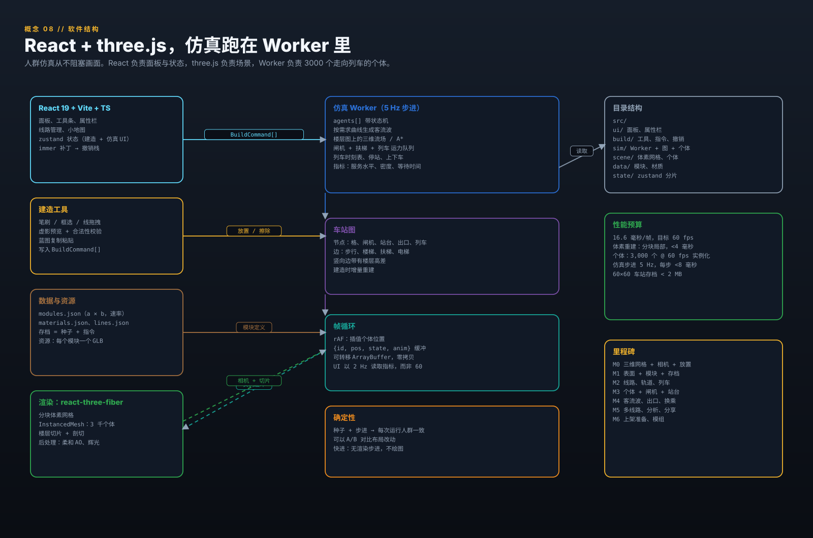
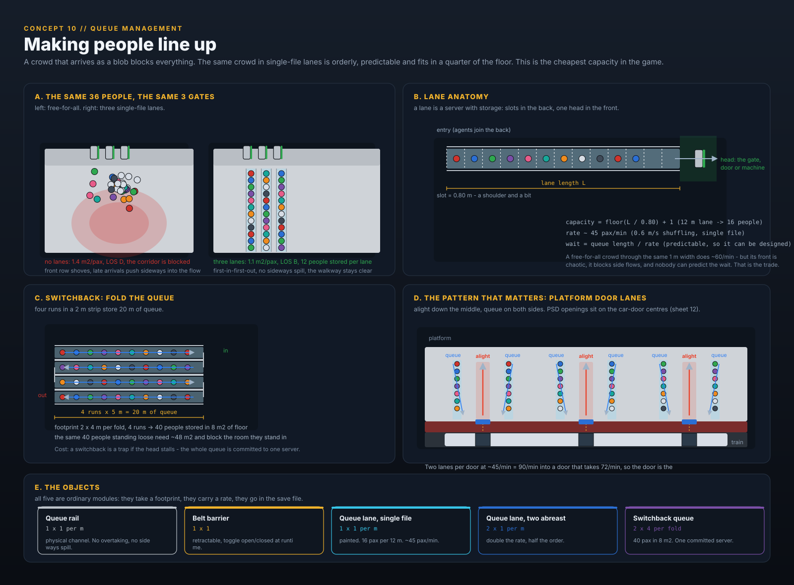

# Metro Station Designer

**A 3D sandbox about moving crowds through a metro station you build yourself.**

Block-based construction (1 block = 1 m) with smooth-corner voxel art, real rolling stock, real
passenger flow. No money, no staff hiring, no upkeep: you build, the crowds arrive, and the
station either copes or it does not.

| | |
|---|---|
| **Platform** | React 19 + Vite + TypeScript, three.js via react-three-fiber, Web Worker simulation |
| **Mode** | Sandbox / puzzle-sim. Single player. |
| **View** | 2:1 isometric 3D, cutaway, per-level slicing, full orbit |
| **Status** | Specification (draft 1). Concept sheets in [`art/`](art/), generator in [`tools/`](tools/) |
| **One-liner** | Overcrowd's readable doll-house dioramas, Mini Metro's flow pressure, real Chinese metro rolling stock |

---

## 1. Concept art

All sheets are vector, generated from [`tools/gen-art.mjs`](tools/gen-art.mjs) (`node tools/gen-art.mjs`).
They are drawn from the same isometric projection the game uses (2:1 dimetric, 1 block = 1 m),
so they double as an art-direction target rather than loose mood boards. Sheet 12 is animated
(SMIL, self-contained); sheet 07 is drawn in the shipping UI language, Simplified Chinese.

### 1.1 The station you are building — isometric cutaway


A B1 concourse in doll-house view with the roof cut off, and the B2 platform visible through the
escalator void. Nine readable zones: fare gates, ticket machines, retail, platform, circulation,
surface entrance, advertising, floor guidance, lift. Everything here is a placeable module from
the catalogue, and every person is a simulated agent with a destination.

### 1.2 Depth is not decoration — vertical section


One station, four levels: an over-ground viaduct (Line 1, catenary), the surface plaza with the
entrance pavilion, a B1 concourse, a B2 platform behind screen doors and a B3 platform. Every
level change is a walk, a queue and a capacity limit. This is the drawing that drives the whole
simulation design.

### 1.3 The block system


One block = one cell with six faces. Faces carry surfaces (floor, ceiling, walls per side), an
8-neighbour autotile mask decides the rounded corners, and bevelled top edges give the chunky,
toy-like silhouette.

### 1.4 What you can place


Fifteen of the placeable modules with their real footprints and the throughput numbers the
simulation actually consumes.

### 1.5 Rolling stock


A / B / C type cars following the Chinese metro classification: car width sets the platform edge,
door count sets the boarding rate, power pickup decides tunnel or viaduct.

### 1.6 Crowd demand


Time-of-day curves, calendar multipliers, transfer paths across depths, and the per-exit flow
controls that shape all of it.

### 1.7 Interface


Build rail on the left, inspector on the right, line manager and minimap along the bottom. The
camera is the level selector. The mock is drawn in the shipping language, Simplified Chinese (§9.2).

### 1.8 Software shape



React owns panels and state, three.js owns the scene, a worker owns three thousand agents walking
to a train.

### 1.9 Camera and views


Full 360° orbit like a CAD viewport, plus true orthographic elevations. The same station model,
six ways of looking at it — and the flat X-Z elevation is the view that tells you whether the
vertical circulation actually works.

### 1.10 Queue management



A crowd that arrives as a blob blocks everything; the same crowd in single-file lanes is orderly,
predictable, and fits in a quarter of the floor. This is the cheapest capacity in the game.

### 1.11 Where the look comes from

The art direction is not invented. It is a stylised read of real Guangzhou Metro stations:
high-key white baffle ceilings, glossy coloured enamel wall panels with visible seams, light
speckled granite floors with dark inlay bands, brushed stainless columns on dark bases, full-height
platform screen doors with a line-colour header band and a red warning band, and saturated
safety-yellow tactile strips and arrows.

Reference photographs studied for this pass (Wikimedia Commons, CC BY-SA 4.0):

* *Platform 3, Guangzhou South Railway Station* — Line 7, the yellow enamel wall panel and the
  station-name typography. `commons.wikimedia.org/wiki/File:Platform_3,_Guangzhou_South_Railway_Station,_Guangzhou_Metro_20240331.jpg`
* *Platform 2, Guangzhou East Railway Station* — Line 11, white linear baffle ceiling, oval
  stainless columns, dark granite inlay bands in the floor, PSD header with the route strip.
  `commons.wikimedia.org/wiki/File:Platform_2,_Guangzhou_East_Railway_Station,_Guangzhou_Metro_20251113.jpg`
* *Guangzhou Railway Station (metro), Line 2 platform* — concourse-adjacent platform, signage and
  lighting treatment. `commons.wikimedia.org/wiki/File:20250222_Guangzhou_Railway_Station_(metro)_-_Platform.jpg`
* *Platform 1, Shiweitang Station* — an older station for contrast.
  `commons.wikimedia.org/wiki/File:Platform_1,_Shiweitang_Station,_Guangzhou_Metro,_20250114.jpg`

These are references only. No photograph is shipped in the game or this repository; the palette and
motifs are reinterpreted in `tools/iso.mjs`.

### 1.12 Rolling stock in 3D


The same A / B / C cars as §1.5, drawn the way the game builds them: a rounded-roof cross-section
extruded along the run, carrying the window band, the door leaves, the livery band, the bogies, the
roof equipment and the leading cab. The consist panel and the platform interface put the car against
the screen doors and the third rail, and the power-pickup panel sets catenary against third rail.

### 1.13 Platform doors and flow


The car-door cadence is authoritative. One function returns the door centres, and the PSD openings,
the queue lanes and the boarding and alighting paths are all placed from that same list, so the
screen doors can never drift from the doors they are meant to meet. The sheet is animated: a 20 s
enter / dock / open / board / close / leave loop.

### 1.14 Two lines, two depths


Concept 02 as a volume. One line runs over the street on a viaduct, one runs under it in a box, and
the whole transfer stack sits between them — B2 platform, B1 concourse, the street, the viaduct
platform. The near quarter is cut away, which is also how the game's cutaway camera works.

---

## 2. Vision

You are handed an empty plot, a grid and a crowd demand curve. You cut a box into the ground,
line it with tiles, drop in gates and escalators, lay track, and connect it to the city. Then you
watch: a wave of passengers comes down the stairs at 08:10, the escalator becomes the bottleneck,
the platform hits crush density, a train arrives and 240 people try to get off through the same
four doorways that 180 people are trying to get on.

There is no fail state and no budget. The scoring is legibility: the game shows you exactly where
your station breaks, in real time, as a heat map, a queue and a wave of little people.

### Pillars

1. **Build like a game, read like a diagram.** Chunky blocks you can snap together in seconds, but
   the layout reads as a real station drawing.
2. **The crowd is the content.** Every visible passenger is an agent with an origin, a destination
   and a decision. No fake crowd textures.
3. **Depth costs.** Vertical distance is real travel time. A deep transfer is a design problem, not
   a decoration.
4. **Readable failure.** The player must always be able to see *why* it broke: a red density blob,
   a growing queue, a train leaving people behind.
5. **Sandbox, not tycoon.** No money, no staff, no upkeep. Only geometry, capacity and time.

### Explicitly out of scope (v1)

- Hiring, wages, staff assignment, morale, training.
- Construction cost, ticket revenue, budgets, loans.
- Failure/ bankruptcy states, timers, scripted scenarios (the calendar can *offer* an event day, but
  it never fails you).
- Multiplayer, mods SDK (planned for M6).

---

## 3. Core loop

```
place geometry  ->  assign lines + exits  ->  run the clock  ->  read the overlays  ->  fix the pinch point
```

1. **Build.** Cut levels, paint surfaces, place modules. Free, instant, undoable.
2. **Connect.** Every exit gets a settable in/out rate. Every platform edge gets a line, stock type,
   direction, headway and dwelling policy.
3. **Run.** Scrub the clock, or fast-forward. Waves spawn from the demand curve through the exits.
4. **Read.** Density heat map, LOS letters, queue lengths, wait-time histograms, boarding/dead
   counts, transfer times.
5. **Fix.** Widen the stair, add a gate, move the escalator, split the flow, add a second exit.

A design session is 20–60 minutes: a station that starts as an open box ends as a machine for
moving people, and the last 10% of capacity always comes from moving a wall.

---

## 4. Blocks, surfaces and levels

### 4.1 The cell

One block is one cubic metre and is addressed as `(level, x, y)`. A cell owns six faces and nothing
else:

```
cell = {
  level,                 // vertical slice id, e.g. "B1"
  x, y,                  // integer grid coords
  fill,                  // solid | empty | water-like (unused in v1)
  faces: {
    top:     { material, floorFinish, decals[] },   // walking surface above
    bottom:  { material, ceilingFinish },           // ceiling below
    n, e, s, w: { material, wallSide, door?, window? },
  },
  tags: [],              // e.g. "paid-zone", "platform-edge", "no-roof"
}
```

Everything the game shows — walkability, cover, signage, whether rain reaches the platform — is
derived from these six faces. That keeps the build model small and makes save files tiny.

### 4.2 Smooth-corner autotiling

* **Mask.** Each cell computes an 8-neighbour mask (4 orthogonal + 4 diagonal).
* **Geometry.** One rounded variant per mask is generated once at load, in the same style as the
  concept sheet: rounded outer corners, filleted inner corners, 12.5 cm bevel on exposed top edges.
* **Merging.** Blocks are merged per 16×16×16 chunk into a single `BufferGeometry`. Floor decals,
  tactile strips, signage and arrows are separate transparent quads drawn on top so they never
  break a merge.
* **Why bevels.** The softened corners are what make a 1 m voxel grid read as a designed building
  instead of a spreadsheet. See sheet 03.

### 4.3 Surfaces and what they do

| Surface layer | Placement | Gameplay effect |
|---|---|---|
| Structural block | cell body | blocks movement, defines cavity |
| Floor finish | top face | walk speed multiplier, noise, spawn of decals |
| Ceiling finish | bottom face | light level, rain cover, ornament |
| Wall (per side) | n/e/s/w | blocks movement and sight, hosts signage, doors, windows |
| Wall side finish | inner/outer of a wall | cosmetic + direction cues (tile vs painted) |
| Decal layer | floor / wall | guide stickers, tactile strips, adverts, wayfinding |

### 4.4 Levels and depth

Levels are named slices with a depth in metres, not free-floating floors:

```
level = { id: "B1", z: -5.5, kind: "underground" | "at-grade" | "viaduct", height: 4.5 }
```

* `underground` — carved into soil, enclosed, no rain, third-rail-friendly.
* `at-grade` — ground level, the default entrance storey.
* `viaduct` — elevated deck with piers; the space below is open air and can host other buildings.

Rules that fall out of this:

* Vertical distance between levels is a cost in the agent pathfinding graph.
* Rain only affects `at-grade`/`viaduct` platform exposure (comfort, no mechanical failure).
* Only `underground` cavities require ventilation logic for the (cosmetic) ceiling.
* Track on a viaduct requires catenary clearance; track in a tunnel forces third rail. See §6.

### 4.5 Zones

Fare zones are an explicit model, not an implied one. Every floor cell belongs to exactly one zone:

| Zone | Meaning |
|---|---|
| `outside` | beyond the station footprint: street, plaza, other buildings |
| `unpaid` | concourse before the fare line: TVMs, retail, customer service |
| `paid` | concourse and passages after the fare line |
| `platform` | platform areas; reachable only from `paid` |
| `restricted` | plant rooms, staff areas, depots |

Rules:

* A **gate** is the only legal crossing between `unpaid` and `paid`. Without a gate, the station
  graph has no edge, so agents physically cannot walk through — no special-casing in the sim.
* **Ticket machines must sit in `unpaid`.** Retail and vending may sit in either, and that is a real
  design choice: unpaid retail catches people on the way in, paid retail catches people waiting for
  a train.
* **Interchange passages can be `paid` → `paid`** (a true inside-the-barrier transfer) or require
  re-gating through `unpaid`. Both are legal; the second costs every transferring passenger a gate
  queue, and the transfer-time report shows it immediately.
* Painting zones is a bucket tool, but the game infers the obvious case: a room fully enclosed by
  gates and platform edges is proposed as `paid` and shown as a dashed tint until confirmed.

Zones give the overlays something real to colour, and they give the builder the single most
consequential decision in a station: where the fare line goes.

---

## 5. Modules

Every module is a footprint (`a × b` blocks), a rotation, and a set of simulation properties. This
is the whole build palette for v1.

### 5.1 Circulation

| Module | Footprint | Capacity / rate | Notes |
|---|---|---|---|
| Staircase | 3 × 6 (per 3.5 m rise) | 25 pax/min per metre up, 33 down | width scales with footprint; queuing happens at the foot; handrails are modelled so the run is walkable |
| Escalator | 1 × 8 | 75 pax/min, one direction | theoretical 150/min at 0.5 m/s; observed flows under crowding land at 60–80, so 75 is the design value |
| Elevator / lift | 2 × 2 | 15 pax/trip, ~40 s cycle | the only step-free path; agents that need it will wait rather than climb |
| Ramp | 2 × n | 30 pax/min per metre | accessible, slow |

### 5.2 Fare control and service

| Module | Footprint | Capacity / rate | Notes |
|---|---|---|---|
| Turnstile gate | 1 × 2 | 25 in / 25 out per min | bidirectional configurable; queue anchor side selectable |
| Accessible gate | 2 × 2 | 18 pax/min | luggage, wheelchairs, strollers; slower because the users are |
| Ticket machine (TVM) | 1 × 1 | **1.5 tickets/min**, 4 queuing | a real transaction is 30–60 s. This is the queue that catches new players out |
| Add-value machine | 1 × 1 | 1.8 pax/min | faster than a TVM: no ticket issue |
| Ticket office window | 2 × 2 | 8 pax/min | unmanned in sandbox; a slow service point |
| Vending machine | 1 × 1 | +6 s dwell, +comfort | no throughput, all lure |
| Retail unit / store | 4 × 6 | 5 shoppers/min in, 4–10 min dwell | draws and releases agents, can seed a platform crowd |
| Convenience kiosk | 3 × 3 | coffee/food, 3 min dwell | smaller, faster, noisier |
| Bench | 1 × 4 | seats 6 | comfort, lets agents wait out a headway |
| Info pillar (totem) | 1 × 1 | wayfinding radius 8 m | cuts decision time |
| Guide sticker (floor map) | 2 × 2 | −15 s search per agent | cheapest fix in the game |
| Ad billboard | 4 × 1 | +browse chance, +dwell | |
| Digital ad tower | 1 × 1 | same, smaller | |
| Restrooms | 3 × 4 | +dwell 90 s, comfort | |
| Vent shaft / light well | 2 × 2 | +1 air-quality step on its level | see §7.7; the design answer to deep, sealed concourses |

### 5.3 Platform edge and access

| Module | Footprint | Capacity / rate | Notes |
|---|---|---|---|
| Platform screen doors (full) | 2 × 1 per pair | 24 doors/min/car, +2 s per boarding | glass, blocks the platform from track |
| Half-height PSD | 2 × 1 per pair | same, cheaper | open above, allows smoke clearance |
| Platform edge + tactile strip | per-edge decal | — | required for a legal boarding zone |
| Swing door | 1 × 1 | 1.2 pax/s when open | can be locked (closed = wall) |
| Wide barrier | 2 × 1 | 40 pax/min | staffed gates, luggage |
| Station exit (surface) | 2 × 6 | **settable in / out per hour** | see §8.3; the primary demand control |
| Emergency exit | 2 × 4 | 0 until triggered | counted for evacuation analysis only |

### 5.4 Track kit

| Module | Footprint | Notes |
|---|---|---|
| Straight track | 1 × 1 per metre | direction locked to a line |
| Curved track | n × n quarter arcs | min radius by stock type (R150 for B, R110 for C) |
| Switch / crossover | 4 × 8 | joins two tracks, allows reversing |
| Buffer stop | 1 × 2 | terminus |
| Third rail segment | 1 × 1 per metre | 750 V DC, forces tunnel or covered box |
| Catenary segment | 1 × 1 per metre + masts | 1500 V DC / 25 kV AC, viaduct or open cut |
| Platform edge for trains | per placed platform | must be within 75 mm of the car floor (auto-snap) |
| Depot / stabling siding | n × m | where consists park between services |

### 5.5 Queue management

The cheapest capacity in the game is not a bigger hall. It is telling people where to stand.

| Module | Footprint | Behaviour |
|---|---|---|
| Queue rail | 1 × 1 per metre | physical channel. Blocks sideways movement, so a lane cannot be jumped |
| Belt barrier (stanchion) | 1 × 1 | retractable belt; toggle open/closed at runtime to re-route a flow |
| Queue lane, single file | 1 × 1 per metre | painted lane. Agents join at the back and cannot overtake |
| Queue lane, two abreast | 2 × 1 per metre | double the rate, half the order |
| Switchback queue | 2 × 4 per fold | folded queue: 40 pax in 8 m² of floor |

A lane is a **server with storage**: slots at the back, one head at the front.

```
capacity = floor(L / 0.80) + 1      // 12 m lane -> 16 people
rate     ≈ 45 pax/min               // 0.6 m/s shuffling, single file
wait     = queue length / rate
```

The trade is deliberate. A free-for-all crowd through the same 1 m width moves ~60 pax/min, but its
front is chaotic, it spills sideways into whatever flow it is next to, and the wait is
unpredictable. A single-file lane is roughly 25% slower and completely legible — and because it is
a declared object with a length, the game can show you its wait time *before* the crowd arrives.

Why it matters more than it sounds:

* **Lanes stop a queue blocking a corridor.** A blob in front of three gates occupies the walkway
  beside them; a lane does not.
* **Switchbacks fit crowds into small rooms.** 40 people standing loose need ~48 m². Folded into a
  2 × 8 m switchback they need 16 m², and they are out of everyone's way.
* **They make the platform-door pattern possible.** Two lanes per door converging on the door with
  the alighting path down the middle is how Chinese metro platforms actually work (sheet 10, panel
  D). Two lanes at 45/min feed a door that takes 72/min, so the door stays the bottleneck — which
  is the honest answer, and the reason dwell time is a design variable.
* **They are the counterweight to escalators.** An escalator is capacity; a lane is order. A station
  with plenty of both survives a peak.

One caveat, and the game models it: a lane commits everyone in it to a single head. If the ticket
machine at the front is slow, the whole lane waits, and re-routing is expensive because agents
cannot leave a lane sideways.

---

## 6. Lines, track and rolling stock

### 6.1 Stock types

Numbers follow the Chinese metro car classification (A/B/C); treat them as the tuning baseline and
verify against GB 50157 before shipping.

| | Type A | Type B | Type C |
|---|---|---|---|
| Width | 3.0 m | 2.8 m | 2.6 m |
| Length / car | 22.0 m | 19.5 m | 19.0 m |
| Height | 3.8 m | 3.8 m | 3.6 m |
| Doors / side | 5 × 1.4 m | 4 × 1.3 m | 4 × 1.2 m |
| Crush / car | 310 | 240 | 200 |
| Rated / car | 250 | 200 | 170 |
| Consist | 6–8 cars | 4–6 cars | 4–6 cars |
| Power | catenary 1500 V DC / 25 kV AC | third rail 750 V DC | third rail 750 V DC (linear-motor variants exist) |
| Typical use | trunk lines, viaducts and open cuts | the workhorse tunnel line | lighter branches, automated lines |

### 6.2 Power pickup is a design constraint

* **Third rail** requires an enclosed or covered track bed. Place track with third rail on an
  over-ground level with no roof and the game flags it as invalid; you can still build it, but the
  level is marked "unsafe: live rail exposed".
* **Catenary** requires vertical clearance above the train (5 m to the wire), so it cannot go under
  a low concourse slab. It is the natural choice for viaducts.
* PSDs only make sense with a tunnel/covered box, which is exactly why underground lines get them.

### 6.3 A line

```
line = {
  id: "2",
  colour: "#2f7ef2",
  stock: "B",
  cars: 6,
  power: "third-rail",
  headway: 150,          // seconds between trains at the platform
  direction: "eastbound",
  dwellBase: 25,         // seconds
  dwellPerPax: 0.35,     // extra dwell per boarding/alighting passenger
  terminus: "reverse" | "through",
  stations: [ ... ]      // ordered platform edges this line calls at
}
```

The line is the unit the player edits: you don't drive trains, you set a timetable, and the
simulation holds it. Headway, cars, dwell policy and terminus behaviour are the four knobs that
matter. The alignment itself is authored with the line tool rather than block by block — see
§13.1 — with free hand-placement reserved for junctions, crossovers and depot throats.

### 6.4 Boarding model

```
board(pax) = doors × doorRate(doorWidth) × ∝(crowding) × (1 − alightPenalty)
dwell = dwellBase + dwellPerPax × (boarding + alighting), clamped to [20 s, 90 s]
```

* Boarding only starts after the last passenger of a preceding wave has cleared the door zone.
* A train that cannot finish boarding inside the clamp leaves people behind. That is the core
  "pressure" readout of the game: a platform that slowly fills over the morning peak.
* Agents decide to board when a train for their line is at the platform *and* the door they are
  queued for will accept them; the queue per door is real, not an abstraction.

---

## 7. Crowd simulation

### 7.1 Agents

Every visible passenger is an agent. Target: **3,000 concurrent agents at 60 fps**, instanced.

```
agent = {
  id, seed,
  od: { from: entryId | trainId, to: exitId | lineId },
  state: "arriving" | "buying" | "queuing" | "walking" | "riding" | "alighting" | "waiting" | "leaving" | "browsing",
  speed: 1.34,            // m/s free flow, derated by density and stairs
  patience: 0.0..1.0,     // how long before they re-route
  group: 1,               // travelling companions stay loosely together
  needs: { stepFree: bool, luggage: bool },
  path: [nodeIds], pathIdx,
  comfort: 0..1,
}
```

Movement is a flow-field + steering hybrid: a coarse graph path (station graph) plus local
separation, so crowds form lanes, queues and clumps instead of walking through each other.

### 7.2 The station graph

Built incrementally as you build, and rebuilt in a worker:

* **Nodes** — every walkable cell cluster, every gate, platform edge segment, train door, exit,
  escalator landing, stair foot, lift, service point.
* **Edges** — walk (cost = distance / local speed), stair, escalator (capacity-limited, direction
  locked), lift (batch, cyclic), gate (queue), door (queue), train (schedule), **queue lane**
  (single-file, N slots, no overtaking).
* **Vertical edges** carry a `levelDelta`, so the path cost of a B3 → viaduct transfer is
  structurally larger — no special-casing needed.

### 7.3 Capacity and LOS

Everything that can be entered is a *server with a queue*. Gates, escalators, lifts, doors, stairs
and platform edges each declare a rate. Agents take the cheapest path whose expected wait is
acceptable, and re-route when a queue's wait exceeds their patience.

Queue lanes are a special case of the same idea: a lane is a server whose "storage" is its own
length, so its wait time is knowable in advance. Agents in a lane move in single file at slot
spacing, cannot overtake, and cannot leave sideways — which is exactly why a lane gives order but
costs throughput (§5.5).

Density uses the Fruin level-of-service letters, which the overlays map straight onto colour:

| LOS | Density (m²/pax) | Reads as |
|---|---|---|
| A | ≥ 1.2 | free flow |
| B | 0.9 – 1.2 | unimpeded |
| C | 0.7 – 0.9 | restricted, still fine |
| D | 0.4 – 0.7 | shuffling, design limit |
| E | 0.2 – 0.4 | intermittent stoppage |
| F | < 0.2 | crush — the thing you are trying to avoid |

### 7.4 Demand: waves from time, date and events

Arrivals are a non-homogeneous Poisson process: a per-exit rate λ(t) shaped by three multipliers.

```
λ_exit(t) = base_exit × curve(timeOfDay) × calendar(dayOfYear) × event(t) × exitControl(exit, t)
```

* **Time of day** — a weekday double peak (≈08:00 and ≈18:00), a Saturday leisure curve, a Sunday
  curve. Editable per station as a shape (volume, sharpness/σ, peak times).
* **Calendar** — weekday 1.0 baseline, weekend ≈0.25–0.45, public holidays with a different shape
  (later peak, longer tail, platform crush at tourist stations), event days at nearby venues.
* **Waves** — two different things, and both matter. Street entries are a smooth Poisson trickle
  (≈22 pax/min at the reference peak). The waves you actually feel are **train-borne**: a 6-car
  B-type train at 45% alighting dumps ~520 people onto one platform in about 40 seconds, every
  150 seconds. That is 3.5 pax/second arriving at the platform exit against 3.5 pax/second of
  escalator+stair capacity. Any slip and the next train arrives before the last one has cleared.
  The HUD shows the next train and the platform's current population so you can watch it coming.
* **Exit control** — every exit has independent in/out rates. Setting Exit 2 to 0 in is how you
  model a closure; the crowd simply re-routes, and you watch the queue form.

### 7.5 Transfers between lines and depths

A transfer passenger is not teleported. They are an agent whose OD is *another line*:

1. Alight from train A, walk to the platform edge exit zone.
2. Climb the level change (stair/escalator/lift) — capacity-limited, queued.
3. Cross the concourse (possibly through the paid zone or a re-gate, your layout decides).
4. Queue at the destination platform, respecting the door they will board through.

The game reports **transfer time** as a distribution: median, p90, and worst. That single number is
the clearest signal of whether your interchange works — and the reason an over-ground line feeding
a deep one is a very different problem from two platforms side by side.

### 7.6 Determinism

`seed + tick → identical crowd`. This is a hard requirement, not a nicety:

* reproducible runs make A/B-ing a layout change meaningful;
* fast-forward runs headless ticks with no rendering;
* bug reports can ship a seed and a save.

### 7.7 Air, depth and enclosure

Deep, sealed concourses get stale, and that is a design pressure without being a failure state.

```
airQuality(level) = openings(level) + shafts(level) - depthPenalty(z) - occupancyPenalty(density)
```

* `openings` counts entrances, viaduct edges, at-grade sides and no-roof flags.
* `shafts` counts vent-shaft / light-well modules (§5.2).
* `depthPenalty` grows with depth below grade; `occupancyPenalty` grows with people per m³.

Effects are soft and legible: at low air quality agents walk faster, browse less, and comfort
drops. Retail takings fall, the platform feels worse, and a haze overlay plus a "stale air" badge
appear on the level. Nobody dies, nothing fails. The fix is always architectural — add an opening,
add a shaft, make the concourse shallower, or stop stuffing 3,000 people into it.

### 7.8 The reference station, and where the bottleneck actually is

Everything in this spec is tuned against one reference station so the numbers can be checked:

**"Wusi Square"** — a mid-size underground station.

| | |
|---|---|
| Entries per weekday | ≈ 17,000 |
| AM peak hour | ≈ 1,200 entries (7% of the day in one hour) |
| Peak 5-minute window | ≈ 110 entries |
| Exits | 3 (two street, one interchange passage) |
| Lines | 2 (B-type 6-car at 150 s headway, C-type 4-car at 180 s) |
| Alighting share at the peak | 45% |

The capacity ladder — checked at the AM peak, worst 5 minutes:

| Stage | Demand | Capacity built | Headroom | Verdict |
|---|---|---|---|---|
| Street → concourse (gates) | 22/min | 3 in-gates = 75/min | 3.4× | never the problem if you build 4+ |
| Concourse → platform (escalators) | 20/min entering | 2 × 75/min | 7.5× | fine on the way in |
| **Platform → concourse (exit)** | **≈ 3.5/s in bursts** | 2 escalators + 1 stair ≈ 3.5/s | **1.0×** | **the bottleneck** |
| Platform edge → train (doors) | 520 alighting per train | 24 doors × 1.2/s | 1.8× | fine until dwell slips |
| Concourse → street (exit gates) | 22/min | 3 out-gates = 75/min | 3.4× | fine |

The conclusion is the whole point of the simulation: **for a normal station the platform exit is
the binding constraint, and it is bursty.** That is why the game makes escalator capacity and
platform population visible at all times, and why a train-borne wave is the dramatic beat of a
morning peak rather than the smooth street trickle.

At a large interchange the ladder shifts: the doors become binding first (dwell stretches, headway
breaks), and the transfer passages become the second constraint. Same model, different answer —
which is exactly what the player is there to discover.

### 7.9 Time: author it, scrub it, replay it

The clock is a tool, not a treadmill.

* **Day types** are authored: a service window (default 05:30–24:00), a 24-point demand curve per
  exit, and a headway profile per line (peak / off-peak / late).
* **Scrub anywhere.** Drag the timeline to 07:50, press play, watch the peak land. Jump to 13:00 to
  check the off-peak retail draw.
* **Replay exactly.** Because the sim is deterministic, re-running 07:00–09:00 after a layout change
  is a true A/B, not a vibe check.
* **Fast-forward** runs headless worker ticks with no rendering — a full day in a few seconds.
* **Day report** summarises each hour: throughput, worst LOS, longest queue, transfer percentiles,
  people left behind, retail draw.

Not an unstoppable 24-hour loop (tedious), and not a timeless sandbox (it loses the drama). Time is
a resource you point at a problem.

---

---

## 8. Analytics and overlays

The simulation is only interesting if you can see it. Overlays are toggles on the same 3D scene.

| Overlay | Shows |
|---|---|
| Crowd density | per-cell heat (LOS A→F) |
| Flow | particle arrows of actual walked paths, weighted by volume |
| Queues | per-asset queue length and wait time |
| Level of service | per-asset LOS letter, worst-first list |
| Boarding | per-door boarding/alighting counts, left-behind counts |
| Throughput | per-exit and per-gate actual vs configured rate |
| Transfer | OD matrix between lines and exits, transfer time percentiles |
| Dead weight | cells nobody walks through (the design smell) |

Plus a running HUD: passengers in the station, worst LOS, total wait, trains late, people left
behind today. And a "day report" you can scrub hour by hour.

---

## 9. Interface

* **Camera** = the level selector, and a full CAD-style viewport. See §9.1.
* **Left rail** = build categories (structure, walls, floors, ceilings, fare gates, retail,
  machines, stairs, escalators, lifts, tracks, signage) with drag, box-drag and line-drag.
* **Right panel** = inspector for the current selection: mode, throughput, queue anchor, access
  zone, tags, live LOS, and what it is connected to.
* **Bottom rail** = line manager (per line: stock, cars, headway, terminus behaviour), minimap,
  clock and speed (`pause / 1× / 4× / 16×`), and the timeline scrubber.
* **Ghost preview** with validity, snap, autotile, blueprint copy/paste, and an undo stack of
  build commands.
* **Simulation controls**: day picker, demand curve editor, per-exit rate sliders, event days.
* **Language** = Simplified Chinese only, with no English mode. See §9.2.

### 9.1 Camera and views

The camera is a first-class tool, because the same station has to be read two ways: as a *place*
(does it feel right?) and as a *drawing* (does it work?).

**Free 360° orbit.** Middle-mouse drag yaws and tilts without limits, from straight down to a
grazing horizon. Nothing snaps unless you ask it to. Wheel dollies; `Shift` + drag pans.

**A nav cube, like a CAD package.** A small cube in the corner carries `TOP`, `FRONT` and `RIGHT`
labels; drag any face, edge or corner to snap the camera to that orientation. Presets on keys:
`1` isometric, `2` plan, `3` last custom angle, `4` flat X-Z elevation, `5` flat Y-Z elevation.
`O` toggles orthographic ↔ perspective, `F` frames the selection, `X` turns other levels into
ghosts, `C` cuts away the near quarter.

**The flat views are the section drawings.** In an orthographic X-Z elevation you are looking at
the station edge-on: level stacking, headroom, shaft depth and the vertical circulation all become
honest, and this is where a deep transfer is designed rather than decorated. The Y-Z view gives
depth and platform width; the plan gives the grid and the flow.

**Level slicing** works in every view. `Q`/`E` step one level up or down; the level you are not
editing dims to 35% and desaturates, and in the flat views the soil is hidden so the section reads.

Concept sheet 09 shows all six views of one model, rendered with the same projection maths the game
uses.

### 9.2 Language

The interface ships in **Simplified Chinese only**. This is not a localisation toggle: station names,
exit numbers, line numbering, unit strings and the level-of-service vocabulary are authored in
Chinese, and concept sheet 07 is drawn in Chinese for that reason. A few things stay ASCII on
purpose, because they are identifiers rather than prose:

* module ids, tag keys and the save-file schema (`gate.turnstile`, `zone.paid`),
* level codes `B4`…`B1`, `G`, `L1`,
* stock classes `A` / `B` / `C` and the `1× / 4× / 16×` speed labels,
* numerals and units inside the Chinese strings (`25 人 / 分`, `间隔 2 分`).

Everything a player reads as a sentence — tool names, inspector field names, connection lists,
line-manager behaviour, minimap counters, warnings — is Chinese.

---

## 10. Technical design

### 10.1 Stack

| Layer | Choice | Why |
|---|---|---|
| UI | React 19 + Vite + TypeScript | panels, inspector, line manager; Simplified Chinese only (§9.2) |
| State | zustand + immer | small store, patch-based undo |
| Scene | three.js + @react-three/fiber + drei | orbit camera, cutaways, gizmos |
| Voxel meshes | custom chunk mesher | merged geometry per 16³ chunk, greedy faces |
| Agents | `InstancedMesh` | 3,000 agents in one draw call |
| Simulation | Web Worker (Comlink) | 5 Hz tick off the main thread |
| Pathfinding | hierarchical: station graph + flow fields | cheap at 3,000 agents |
| Persistence | JSON save = seed + command log | tiny files, exact replays |
| Assets | GLB per module, generated voxel meshes | swappable, mod-friendly |

### 10.2 Frame and tick

```
main thread  : rAF @60fps -> interpolate agents between ticks -> render
worker       : 5 Hz tick  -> agents, queues, trains, metrics
worker -> main: transferable Float32Array [id, x, y, z, state, phase]
main -> worker: BuildCommand[] on build, control messages on play/pause/speed
```

* The UI reads metrics at 2 Hz, never per frame.
* Fast-forward runs worker ticks with no draw calls.
* Time-of-day = 24 sim-hours in ~12 real minutes at 1× (tunable).

### 10.3 Sim constants (initial tuning)

| Constant | Value |
|---|---|
| Free walk speed | 1.34 m/s (1.0 on stairs, +8% on escalator) |
| Density speed derate | `factor = clamp(0.35 + 0.65 × (m²perPax − 0.2) / 1.0, 0.35, 1.0)` — matches the LOS bands: 1.0 at ≥1.2 m²/pax, ~0.35 at crush |
| Gate rate | 25 pax/min (18 accessible) |
| TVM | 1.5 tickets/min, 4-person queue space |
| Escalator rate | 75 pax/min per unit, direction-locked |
| Queue lane | slot spacing 0.80 m, shuffle speed 0.6 m/s, ≈45 pax/min single file |
| Stair rate | 25 up / 33 down per min per metre width |
| Lift | 15 pax, 40 s cycle |
| Train door rate | 1.2 pax/s at 1.4 m door, derated with crowding |
| Dwell | 25 s + 0.35 s/pax, clamp 20–90 s |
| Boarding cutoff | 3 s before departure |
| Agent patience before re-route | 60–180 s, varies per agent |
| Retailing dwell | 3–10 min |
| Sim tick | 200 ms |
| Day length at 1× | 12 real minutes |
| Reference station | ≈17,000 entries/weekday, ≈1,200 AM peak hour (§7.8) |

### 10.4 Performance budget

| Item | Budget |
|---|---|
| Frame | 16.6 ms |
| Voxel chunk rebuild | < 4 ms, chunk-local |
| Agents (3,000, instanced) | 1 draw call, < 3 ms update on the main thread |
| Sim tick | < 8 ms in the worker |
| Panels | React re-render only on selection/metrics change |
| Save file | < 2 MB for a 60×60 station |

---

## 11. Art direction

Target register: **Overcrowd-style doll-house dioramas** rendered in the material language of a
real Guangzhou Metro station. Flat, saturated, high-contrast colours; chunky silhouettes; heavy
outlines; a bright interior against a dark world. The art must never be so detailed that a crowd of
3,000 stops reading as a crowd.

* **Projection** — 2:1 dimetric isometric for the build view (a stylised ratio, not true isometric),
  with free 360° orbit and true orthographic elevations for reading the section. See §9.1.
* **Silhouette** — blocky 1 m voxels, 12.5 cm bevels, 8-neighbour rounded corners. Placed modules
  are rounded-corner boxes too: ticket machines, gates, totems, benches, lift shafts and columns
  all soften their vertical edges, so nothing reads as a raw cube.
* **The interior is high key.** Light speckled granite floors with dark inlay bands, white panels,
  brushed stainless, glass. The world outside — soil, sky, surrounding buildings — stays dark, so
  the station glows and the crowd is the most saturated thing on screen.
* **One line colour per line, used big.** A station's identity is a glossy enamel wall panel in the
  line colour with visible panel seams and the station name set into it, plus a coloured band along
  the top of the walls and along the PSD header. Everything else is white, grey or metal.
* **Safety colour is sacred.** Red warning bands at the platform edge and on the PSD, yellow tactile
  strips and guide arrows, dark maroon for the platform edge zone. These are the only places red and
  yellow appear without meaning something.
* **Ceilings** are white linear baffles with recessed light panels; the soffit over escalators and
  under mezzanines is darker metal so the void reads.
* **Columns** are brushed stainless with a dark base band, rounded, spaced on the grid — they are
  also the easiest way to give a big flat room scale.
* **Outlines** — dark, 0.8 px at design scale, drawn per face. It is what makes faces legible at
  distance.
* **Lighting** — one key light plus strong ambient plus a soft contact-shadow blob under every
  object. Warm strip lights in ceilings, cool daylight from entrance pavilions and light wells.
* **Signage** — every sign is a readable quad: line numbers, exit arrows, warning strips, ad panels,
  floor maps. Signage is gameplay, not decoration.
* **Readability rules** — no texture detail below 0.25 m; crowd sprites stay under ~40 px tall; the
  level you are not editing dims to 35% and desaturates; the crowd keeps a fixed hue palette that
  never matches a line colour.

Palette swatches are on concept sheet 03, and the reference photographs that informed them are
listed in §1.10.

---

## 12. Roadmap

Each milestone is shippable and playable on its own.

| # | Milestone | Contents | Done when |
|---|---|---|---|
| **M0** | Grid in the browser | Vite + React + R3F, 360° orbit + nav cube + flat ortho views, level slices, place/erase single blocks, undo | you can carve a box into the ground, orbit it, and look at it edge-on |
| **M1** | Surfaces, zones and modules | surface painting, autotile bevels, rounded-corner modules, fare zones, module catalogue, save/load | you can build the sheet-01 concourse by hand, zone it, and save it |
| **M2** | Track and trains | line tool + free junctions, third rail vs catenary validation, line manager, A/B/C stock, PSDs | a train arrives, dwells and leaves on a headway |
| **M3** | Agents | worker sim, station graph, walk/queue/gate, queue lanes + rails, platform boarding, LOS overlay | 500 agents enter through an exit, line up, board a train and leave |
| **M4** | Waves, control and time | demand curves, calendar, per-exit rates, train-borne waves, transfers, timeline scrub + day report | an AM peak breaks your station and you can see exactly where |
| **M5** | Multi-line and analytics | 3+ lines, depth transfers, density/flow/queue overlays, layout A/B by seed | a full interchange runs for a sim-day and reports transfer percentiles |
| **M6** | Polish and mods | air-quality model, data-driven modules, Steam wrapper (Electron/Tauri), workshop format, performance pass | a stranger can build a station, share it, and break it |

---

## 13. Design decisions

The four open questions from the first draft are now decided. Everything above assumes these.

### 13.1 Track is authored with a line tool, not block by block

**Decision:** you draw a *line* as an ordered list of platform edges, and the alignment is generated
along it. Manual geometry is reserved for junctions.

* **Draw mode** — click platform edges in order. The tool routes a smooth alignment between them and
  shows waypoints you can drag.
* **Validation while drawing** — minimum curve radius by stock (A/B/C), maximum grade (4% absolute,
  2–3% preferred), clearance envelope, and a hard error if you put third rail somewhere uncovered.
* **Free mode** — switches, crossovers, depot throats and reversing sidings are hand-placed, because
  that is the part of track layout people actually enjoy fiddling with.
* **Why not pure free laying** — a full station is 120–160 m of track at 1 m resolution. Block-by-
  block would be thousands of clicks for geometry nobody wants to hand-place, and it would leave the
  line model (headway, terminus behaviour, service pattern) with nothing to attach to.
* Track is still *made of* blocks, so the art and the collision model stay consistent.

### 13.2 Fare zones are explicit

**Decision:** yes — `outside / unpaid / paid / platform / restricted`, per §4.5. Gates are the only
legal crossing. This drives ticket-machine placement, retail placement, and whether a transfer is
inside the barrier or costs a re-gate. It is the most consequential single decision a player makes.

### 13.3 Time is authored, scrubbed and replayed

**Decision:** a scrubbable timeline with authored day types, not an unstoppable 24-hour loop and not
a timeless sandbox. Per §7.9: set the curve, jump to 07:50, watch the peak, get a day report, then
re-run the same window after a layout change because the sim is deterministic.

### 13.4 Ventilation is a comfort model, not a failure model

**Decision:** depth and enclosure affect air quality, and air quality affects agent comfort, walking
speed and browsing — never survival, never a fail state. Per §7.7. The fix is architectural: an
opening, a vent shaft, a shallower concourse, or fewer people.

### 13.5 Residual risks

| Risk | Mitigation |
|---|---|
| 3,000 agents × a station of 50k cells is a lot of pathfinding | hierarchical graph + flow fields; agents re-path only on state change |
| Cutaway levels are confusing to build in | one-level-at-a-time editing is the default; the level slider is the primary tool, and the flat views show the whole stack |
| Queue simulation is where the fun hides *or* where it gets boring | expose the queue as a visible object early (M3) and tune before adding features |
| Real-world numbers may not be fun (a correct escalator is too efficient) | all constants live in one data file and are meant to be tuned; §7.8 is the calibration target |
| A full station is 120–160 m long, which is a huge grid | the line tool, blueprints and copy/paste must make long repetitive geometry cheap |
| Rolling stock and pedestrian-flow figures need verification | cross-check GB 50157-2013 / GB 50490 and a pedestrian-flow handbook before shipping the numbers |
| Free 360° orbit can disorient players | nav cube, five presets, and a "return to build view" key; the build grid is always world-aligned |

---

## 14. Appendix

### 14.1 Repository layout

```
metro/
  GAME-SPEC.md            <- this document
  art/                    <- concept sheets (SVG, generated)
    01-isometric-cutaway.svg
    02-vertical-section.svg
    03-block-system.svg
    04-module-catalogue.svg
    05-trains-and-track.svg
    06-crowd-demand.svg
    07-interface.svg
    08-architecture.svg
    09-camera-and-views.svg
    10-queue-management.svg
    11-rolling-stock-3d.svg
    12-platform-doors-flow.svg
    13-two-line-interchange.svg
  tools/
    iso.mjs               <- shared isometric library: palette, projection, rounded boxes, stock, sprites
    train-iso.mjs         <- rolling stock in 3D: rounded-roof car section extruded along the run
    sheets-a.mjs          <- sheets 02-04 (vertical section, blocks, catalogue)
    sheet-01-hero.mjs     <- sheet 01, the isometric cutaway
    sheets-b.mjs          <- sheets 05, 06, 08 (stock numbers, demand, software shape)
    sheet-07-ui.mjs       <- sheet 07, the Chinese-only interface mock
    sheets-c.mjs          <- sheet 09, includes a tiny orthographic box renderer
    sheets-d.mjs          <- sheet 10, plan-view diagrams for queueing
    sheets-e.mjs          <- sheet 12, animated platform doors and passenger flow
    sheet-11-trains3d.mjs <- sheet 11, rolling stock in 3D
    sheet-13-two-line.mjs <- sheet 13, two lines at two depths
    gen-art.mjs           <- node tools/gen-art.mjs  -> writes art/
    zoom.mjs              <- dev helper: crop a sheet for inspection
    serve.mjs             <- dev helper: static server for viewing art

  (planned)
  src/
    ui/                   <- panels, inspector, line manager, timeline
    build/                <- tools, commands, undo, validation, zones
    sim/                  <- worker: graph, agents, trains, waves, metrics
    scene/                <- voxel mesher, agents, camera rig, nav cube, overlays
    data/                 <- modules.json, materials.json, stock.json, curves.json
    state/                <- zustand slices
```

### 14.2 Glossary

* **PSD** — platform screen doors; glass doors between platform and track.
* **TVM** — ticket vending machine.
* **LOS** — level of service; a density letter grade (A free → F crush).
* **OD** — origin/destination; what an agent is trying to do.
* **Third rail** — a live rail at track level, the usual choice in Chinese tunnels.
* **Catenary** — overhead wire, the usual choice on viaducts and open cuts.
* **Headway** — time between trains on a line at a platform.
* **Dwell** — how long a train stands at a platform with doors open.
* **Queue lane** — a single-file channel (painted or railed) that agents join at the back and cannot
  overtake; a server whose storage is its own length (§5.5).
* **Switchback / serpentine** — a queue folded into parallel runs to store more people in less floor.

### 14.3 References

* Overcrowd: A Commute 'Em Up — art and readability reference (<https://store.steampowered.com/app/726110/>).
* Mini Metro — flow pressure without micromanagement.
* GB 50157 (metro design) / GB 50490 (metro technical standards) — car types, platform widths, clearance.
* Fruin, *Pedestrian Planning and Design* — the LOS density bands used in §7.3.
* Guangzhou Metro station photographs, Wikimedia Commons, CC BY-SA 4.0 — the specific files are
  listed in §1.10. Used as visual reference only; nothing is redistributed.
